# Palomix

## 👥 Miembros del Equipo
| Nombre y Apellidos | Correo URJC | Usuario GitHub |
|:--- |:--- |:--- |
| Matias Maccarrone | ma.maccarrone.2023@alumnos.urjc.es | MatiasMaccarrone |
| Alejandro Carretero Badorrey |a.carreterob.2023@alumnos.urjc.es | Carretero2005 |
| Raúl Sánchez López | r.sanchezl.2023@alumnos.urjc.es | RaulSanchezLopez |
| Carla García Romero |c.garciarom.2023@alumnos.urjc.es | Carlss50 |

---

## 🎭 **Preparación: Definición del Proyecto**

### **Descripción del Tema**
La aplicación va a ser una mejora de la actual LetterBox, es decir, una aplicación de reseñas de peliculas y series. La diferencia con LetterBox es que va a tener funcionalidades adicionales a las actuales, como listas con recomendaciones o filtros de búsquedas, entre otras.

### **Entidades**
Indicar las entidades principales que gestionará la aplicación y las relaciones entre ellas:

1. Usuario: Id
   - 1.1 Usuario Anonimo
   - 1.2 Usuario Registrado: Nombre de Usuario, Correo electrónico y Edad.
   - 1.3 Administrador: Nombre de Usuario, Correo electrónico, Edad y Permisos.
2. Filmografía: Id, Nombre, Duración, Media de Valoraciones, Plataformas, Sinopsis y Año.
   - 2.1 Película 
   - 2.2 Series: Temporadas.
3. Valoración: Estrellas, Reseñas.
4. Director: Nombre, Año de Nacimiento.
5. Género: Nombre.
6. Listas: Nombre y película/serie.

**Relaciones entre entidades:**
- Usuario Registrado - Valoración : Un Usuario puede tener una o varias Valoraciones, pero cada Valoración pertenece a un único Usuario (1:N)
- Usuario Registrado - Listas : Un Usuario puede crear y modificar cero o varias Listas, y una Lista pertenece solo a un Usuario (1:N)
- Usuario - Filmografía : Un Usuario puede buscar una o varias Filmografías, y una Filmografía puede ser vista por uno o varios Usuarios (N:M)
- Administrador - Filmografía : Un Administrador puede modificar cero o varias Filmografías, y una Filmografía puede ser modificada por uno o varios Administradores (N:M)
- Filmografía - Valoración : Una Filmografía puede tener cero o varias Valoraciones, pero cada Valoración se asigna a una sola Filmografía (1:N)
- Filmografía - Listas : Una Filmografía puede estar incluida en cero o varias Listas, y una lista puede contener una o varias Filmografías (N:M)
- Filmografía - Género : Una Filmografía puede pertenecer a uno o varios Géneros, y un Género puede tener cero o varias Filmografías (N:M)
- Director - Filmografía : Un Director puede dirigir una o varias Filmografías, y una Filmografía está dirigida por un único Director (1:N)


### **Permisos de los Usuarios**
Describir los permisos de cada tipo de usuario e indicar de qué entidades es dueño:

* **Usuario Anónimo**: 
  - Permisos: Visualizar filmografías, listas de filmografías y valoraciones de filmografías.
  - No es dueño de ninguna entidad

* **Usuario Registrado**: 
  - Permisos: Gestionar su perfil, añadir/borrar/modificar sus valoraciones, crear/modificar listas de filmografías, modificar su historial de filmogrfías, visualizar estadisticas de filmografías y géneros, y las mismas funcionalidades del usuario anónimo
  - Es dueño de: Su Perfil de Usuario, sus Valoraciones y sus Listas de filmografía

* **Administrador**: 
  - Permisos: Gestión completa de filmografías, visualización de estadísticas y moderación de contenido en valoraciones 
  - Es dueño de: filmografías, géneros y directores puede gestionar todos las valoraciones, Usuarios y listas de filmografías 

### **Imágenes**
Indicar qué entidades tendrán asociadas una o varias imágenes:

- Usuario Registrado y Administrador - Una imagen de avatar 
- Filmografía - Una imagen de portada
- Lista de Filmografía - Portada de la primera Filmografía

### **Gráficos**
Indicar qué información se mostrará usando gráficos y de qué tipo serán:

- Gráfico circular de filmografías vistas por género
- Gráfico de barras de valoraciones de filmografías del usuario
- Gráfico de barras de valoraciones de cada filmografías

### **Tecnología Complementaria**
Indicar qué tecnología complementaria se empleará:

- Envío de correos electrónicos automáticos mediante JavaMailSender, que nombre las filmografías agregadas

### **Algoritmo o Consulta Avanzada**
Indicar cuál será el algoritmo o consulta avanzada que se implementará:

- **Algoritmo/Consulta**: Sistema de recomendaciones basado en el historial de valoraciones del usuario
- **Descripción**: Analiza las filmografías valoradas  y sugiere similares utilizando filtrado colaborativo
- **Alternativa**: Filtrado de filmogrfías por género, director y valoración general

---

## 🛠 **Práctica 1: Maquetación de páginas web con HTML y CSS**

### **Diagrama de Navegación**
Diagrama que muestra cómo se navega entre las diferentes páginas de la aplicación:


> Se puede entrar tanto por la página de Login como por la Principal (muestra las películas). Todas las páginas excepto Login y SignUp pueden navegar a través del header y footer. Las dos mencionadas solo por el footer.

### **Capturas de Pantalla y Descripción de Páginas**

#### **1. Página principal / Home**
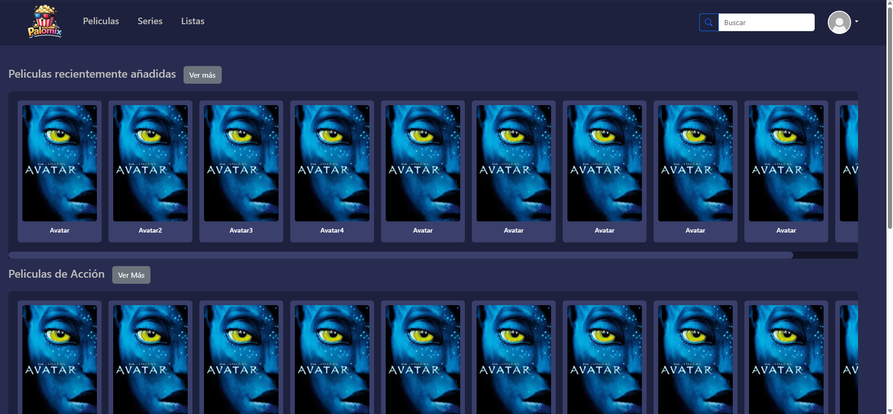

> Página de inicio, en la cual se podrán ver una serie de películas seleccionadas por el sistema, dividas por categorias, con la posibilidad de ver más peliculas de ese tipo y el detalle de cada una. 

#### **2. Series**
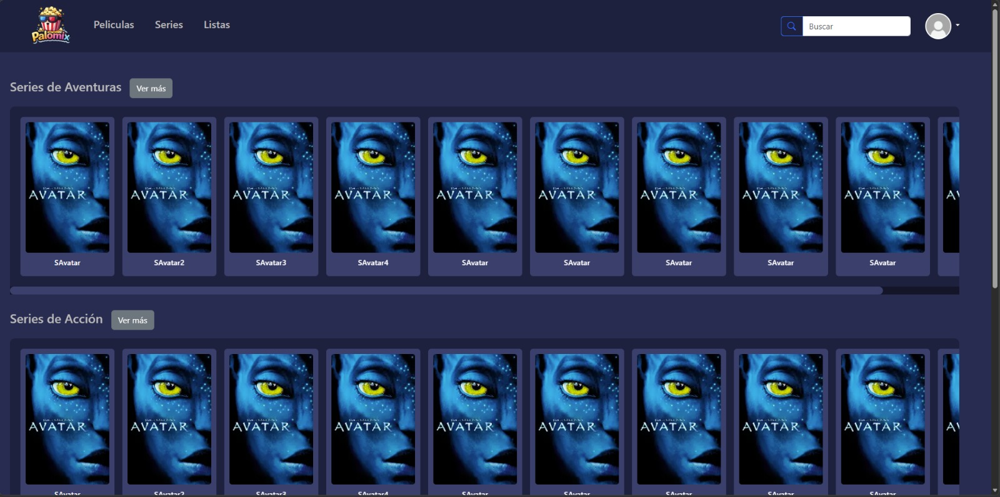

> Página igual a la principal, pero con la diferencia que se ven series.

#### **3. Listas del sistema**
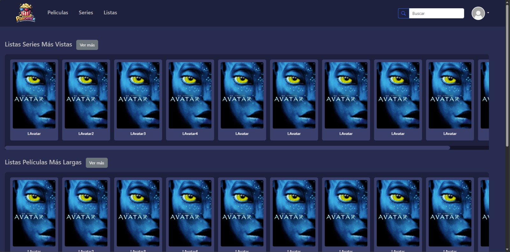

> Página en la que se muestran las listas generadas por el sistema, dando la posibilidad de ver en detalle cada lista, es decir, ver las peliculas o series que la componen.

#### **6. Perfil**
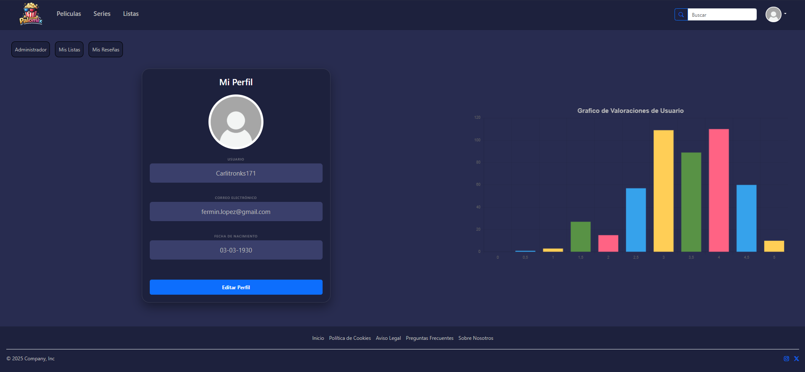

> Página en la que el usuario podrá ver o editar su perfil, es decir, sus datos, además de que puede ver sus listas, hechas por él, y en el caso de que tenga permisos de administrador, acceder a dicha sección.

#### **7. Detalles de las listas**


> Página donde se muestran todas las películas o series que componen una lista, con la posibilidad de acceder al detalle de cada una de ellas. 

#### **8. Detalles de las películas**
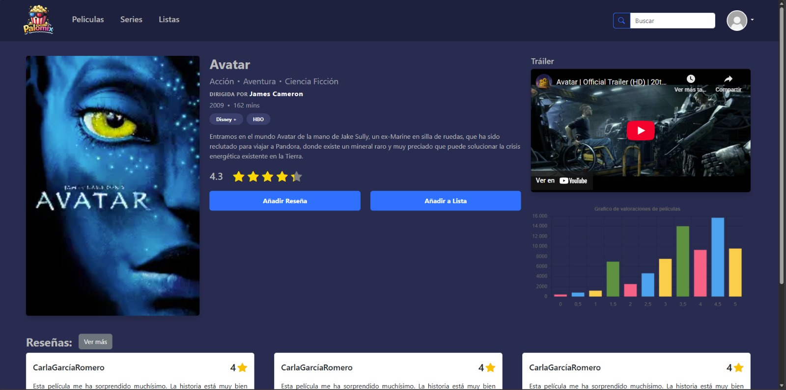

> Página de detalle de una película, donde se muestra toda la información de la película, como su sinopsis, año de estreno, duración, etc. Además, se muestran las valoraciones que tiene la película y el usuario puede añadir su propia valoración. También se encuentra un trailer, un botón para añadir la película a una lista y un botón para ver las reseñas de la película. 

#### **9. Detalles de las series**
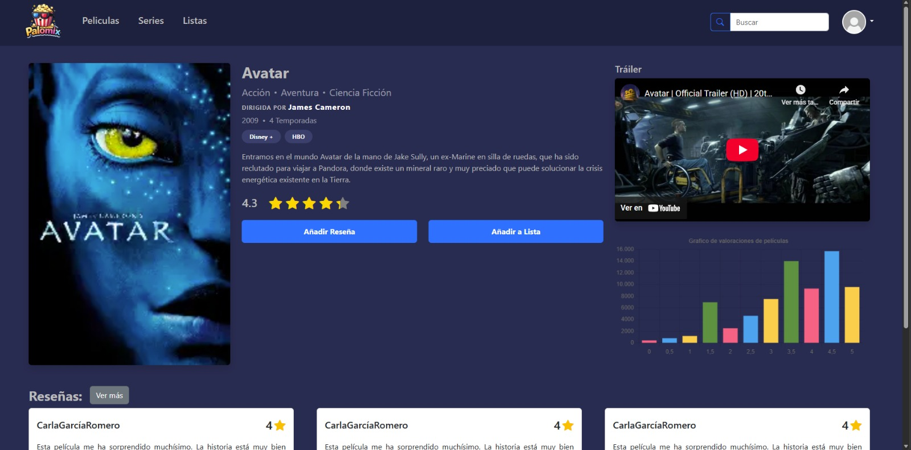

> Página de detalle de una serie, con la misma información que la página de detalle de una película, pero con la diferencia de que se muestra el número de temporadas, en lugar de la duración. 

#### **10. Añadir reseña**
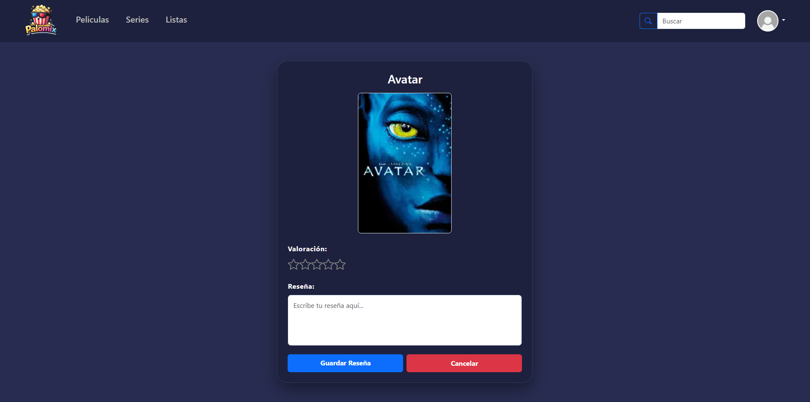

> Página en la que se muestra la cartelera de la película/serie y se puede añadir una valoración y una reseña escrita.

#### **11. Reseñas**
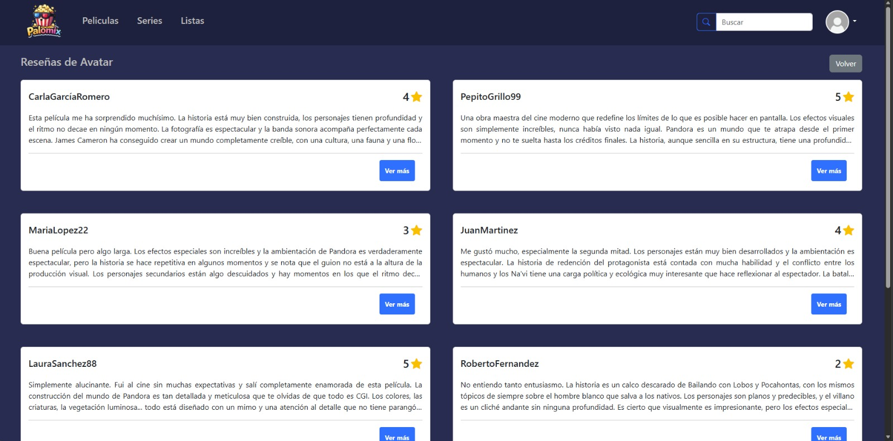

> Página en la que se muestran una lista de todas las reseñas de una película/serie De cada reseña se tiene su valoración y su reseña escrita además del nombre del usuario que la escribió.

#### **12. Mis listas**


> Página donde los usuarios pueden ver las listas que han creado, con la posibilidad de acceder a cada una de ellas para ver su contenido o eliminarla.

#### **13. Mis reseñas**
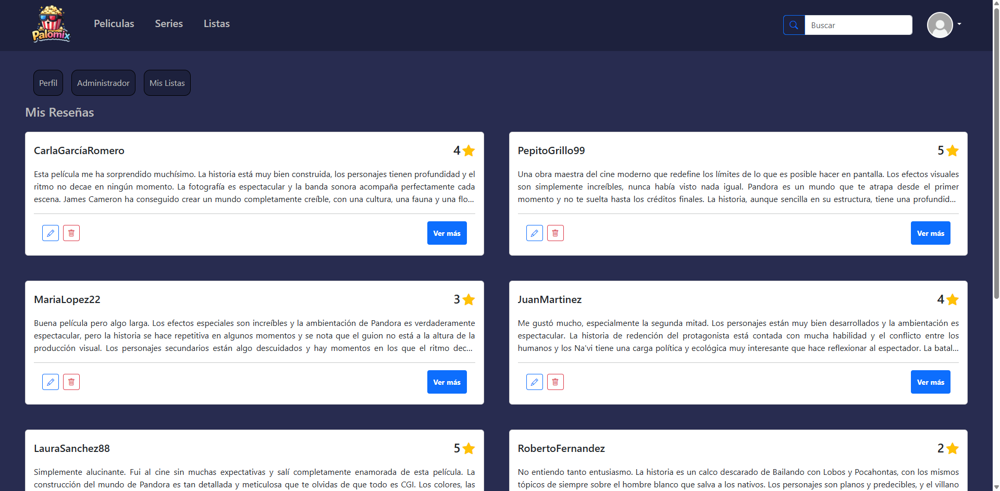

> Página donde los usuarios pueden ver las reseñas que han creado, con la posibilidad de acceder a cada una de ellas para ver su contenido, modificarla o eliminarla.

#### **14. Modificar reseña**
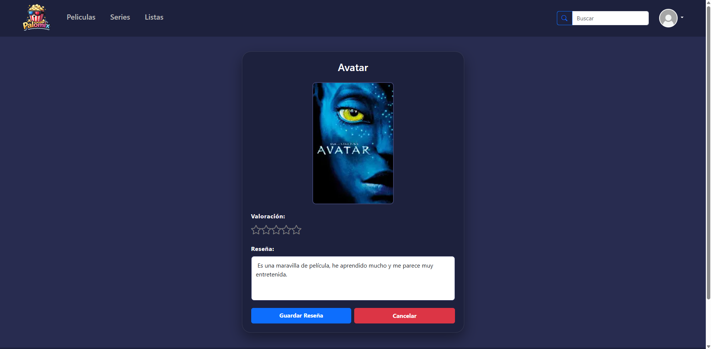

> Página donde se muestra una reseña que ya ha sido escrita y que el usuario quiere modificar. Se puede modificar tanto la puntuación como la parte escrita.

#### **15. Administrador**
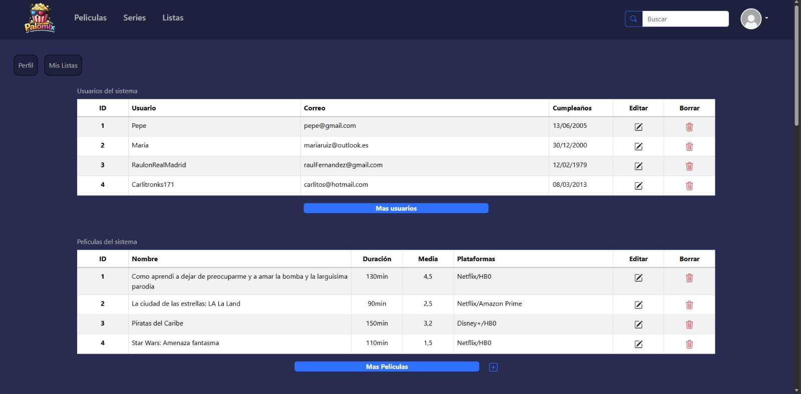

> Página donde el administrador puede editar y eliminar usuarios, películas, series, y listas tanto del sistema como de cada usuario. Además se pueden añadir series y películas. En la parte inferior, se encuentra un gráfico con los géneros.

#### **16. Añadir película**


> Página de creación de películas, con un formulario para introducir los datos de la película, como el título, la sinopsis, el año de estreno, etc.

#### **17. Modificar película**
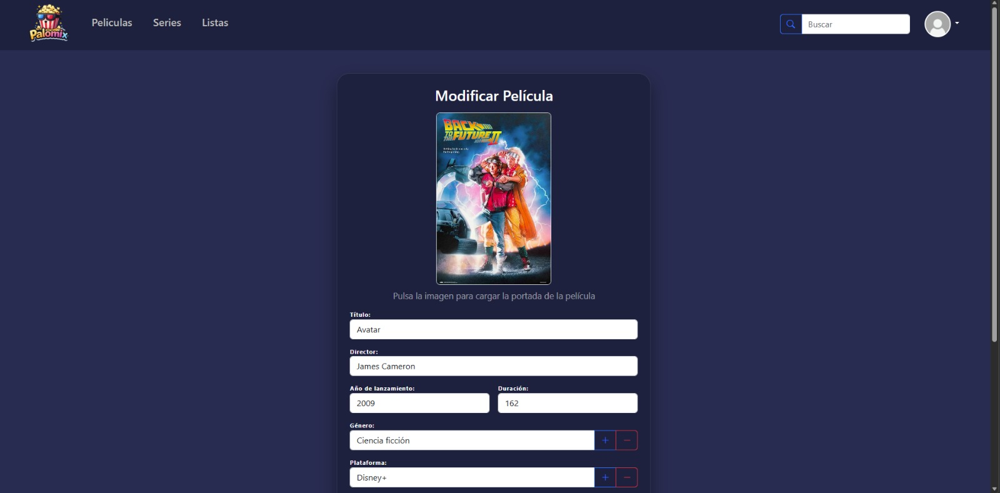

> Página de modificación de películas, con un formulario para editar los mismos datos que se añaden en la página de creación de películas, pero con los campos ya rellenados con la información actual de la película que se va a modificar.

#### **18. Añadir serie**


> Página de creación de series, con un formulario para introducir los datos de la serie, como el título, la sinopsis, el año de estreno, etc.

#### **19. Modificar series**
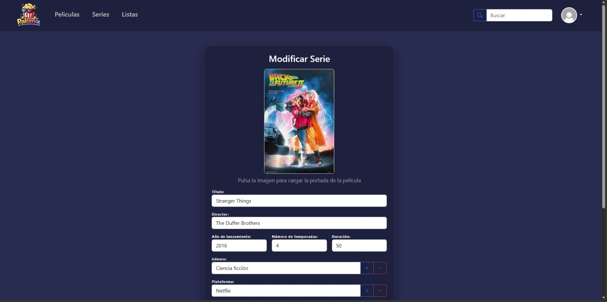

> Página de modificación de series, funciona igual que la de las películas, pero con los campos correspondientes a las series, como el número de temporadas.

#### **20. Políticas de cookies**


> Página con información sobre las políticas de cookies de la aplicación, explicando qué tipos de cookies se utilizan, su finalidad.

#### **21. Aviso legal**


> Página con información legal sobre la aplicación, incluyendo términos de uso, propiedad intelectual y responsabilidad.

#### **22. Preguntas Frecuentes**
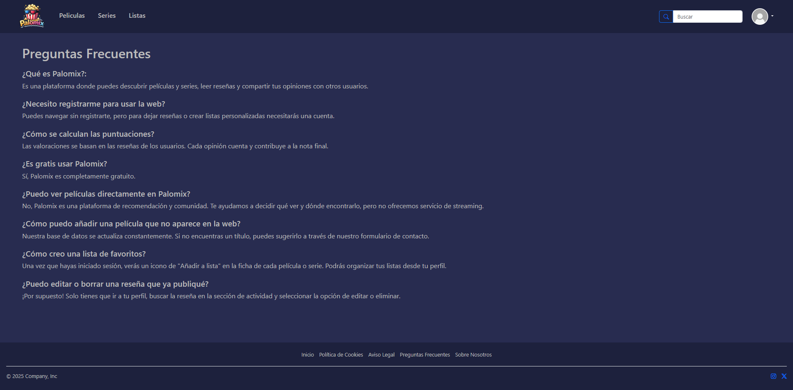

> Página en la que se muestran las preguntas frecuentes de los usuarios, con su respuesta correspondiente, para resolver dudas comunes sobre el funcionamiento de la aplicación.

#### **23. Sobre nosotros**
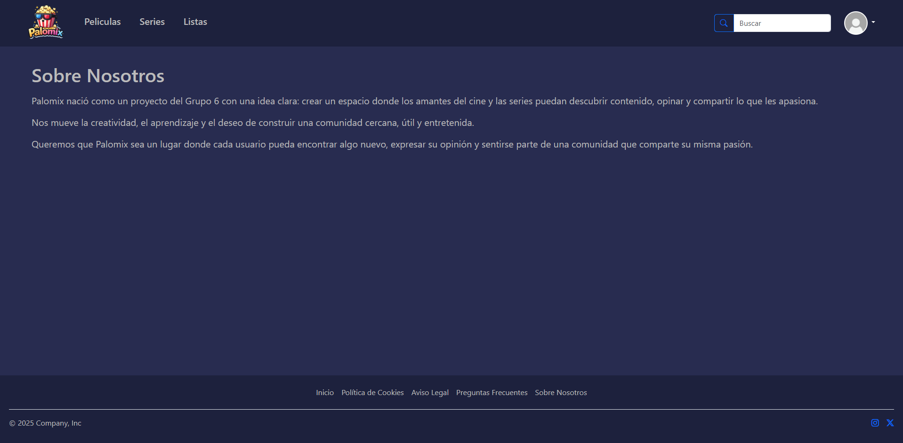

> Página en la que se explica quiénes somos y qué hacemos.


### **Participación de Miembros en la Práctica 1**

#### **Alumno 1 - [Nombre Completo]**

[Descripción de las tareas y responsabilidades principales del alumno en el proyecto]

| Nº    | Commits      | Files      |
|:------------: |:------------:| :------------:|
|1| [Descripción commit 1](URL_commit_1)  | [Archivo1](URL_archivo_1)   |
|2| [Descripción commit 2](URL_commit_2)  | [Archivo2](URL_archivo_2)   |
|3| [Descripción commit 3](URL_commit_3)  | [Archivo3](URL_archivo_3)   |
|4| [Descripción commit 4](URL_commit_4)  | [Archivo4](URL_archivo_4)   |
|5| [Descripción commit 5](URL_commit_5)  | [Archivo5](URL_archivo_5)   |

---

#### **Alumno 2 - Matias Maccarrone**
- **HTML (principal, series, lists, login, signUp)**
Creé las páginas principales de la app: la pantalla de inicio con secciones de películas/series/listas, las páginas de login y registro con formularios validados, y la estructura de navegación común con navbar y footer.

- **JavaScript (searchFunc, loadMoviesSeriesLists)**
Implementé la búsqueda en tiempo real que filtra películas, series y listas mostrando resultados o un mensaje de error, y la carga dinámica de contenido que detecta en qué página está el usuario y rellena las tarjetas correspondientes.

- **JavaScript (signUpLogin)**
Desarrollé la lógica de login con validación de email y contraseña, y el registro de nuevos usuarios con verificación de campos, coincidencia de contraseñas y validación de fecha de nacimiento. 

| Nº    | Commits      | Files      |
|:------------: |:------------:| :------------:|
|1| [Creación de la página Login y SignUp, aunque se modificaron por diversos errores, la estructura de la página es esta ](https://github.com/CodeURJC-SSDD-2025-26/ssdd-2025-26-project-base/commit/8672d33d09f2f68f70b09845726ffb1172b8ca70#diff-f7df8ca1f6a5b4e55cc08d43d079af1235a1a87cf8799fe7813f42440378ef4a)  | [login.html](https://github.com/CodeURJC-SSDD-2025-26/practica-ssdd-2025-26-grupo-6/blob/main/login.html), [signUp.html](https://github.com/CodeURJC-SSDD-2025-26/practica-ssdd-2025-26-grupo-6/blob/readMe-maty/signUp.html)   |
|2| [Creación de la página de Peliculas, Series y Listas, por más que se corrigieron varias veces, la forma de las páginas es la misma en el resultado final](https://github.com/CodeURJC-SSDD-2025-26/ssdd-2025-26-project-base/commit/3ecd2a792b263776659ef8de694abdffca2ba486)  | [principal.html](https://github.com/CodeURJC-SSDD-2025-26/practica-ssdd-2025-26-grupo-6/blob/main/principal.html), [series.html](https://github.com/CodeURJC-SSDD-2025-26/practica-ssdd-2025-26-grupo-6/blob/main/series.html), [listas.html](https://github.com/CodeURJC-SSDD-2025-26/practica-ssdd-2025-26-grupo-6/blob/main/lists.html) |
|3| [Creación del Header y Footer de las páginas, luego se agregó un menú dropdown en el perfil pero la estructura general se conservó](https://github.com/CodeURJC-SSDD-2025-26/ssdd-2025-26-project-base/commit/fa2bbbf3ee648cd8114fd858f4e05062e318f94e)  | [principal.html](https://github.com/CodeURJC-SSDD-2025-26/practica-ssdd-2025-26-grupo-6/blob/main/principal.html)   |
|4| [Adición de distintas funciones con javaScript, tales como, filtros para el login o signUp, el permitir agregar nueva filmografia con solo escribir sus datos en una estructura en el fichero .js, y que funcione la barra de búsqueda de la cabecera. Estas funcionalidades fueron separadas para más claridad y errores que habían. (El link del commit es el primer código)](https://github.com/CodeURJC-SSDD-2025-26/ssdd-2025-26-project-base/commit/d25cedeb38bed0ac17684903221b7cc5615c1724#diff-d455aa836573252d1dfd9da86558c49ddb9cd10a62efae8093bfad90552a0a7a)  | [loadMoviesSeriesList.js](https://github.com/CodeURJC-SSDD-2025-26/practica-ssdd-2025-26-grupo-6/blob/main/js/loadMoviesSeriesLists.js), [loginSignUp.js](https://github.com/CodeURJC-SSDD-2025-26/practica-ssdd-2025-26-grupo-6/blob/main/js/signUpLogin.js)   |
|5| [Funcionamiento completo de la barra de búsqueda del header mediante javaScript. (El link del commit es de la primera implementación, luego se separó y corrigió)](https://github.com/CodeURJC-SSDD-2025-26/ssdd-2025-26-project-base/commit/15bfdacc1929677929eafd81bbcaca917341c7e6)  | [searchFunc.js](https://github.com/CodeURJC-SSDD-2025-26/practica-ssdd-2025-26-grupo-6/blob/main/js/searchFunc.js)    |

---

#### **Alumno 3 - [Raúl Sánchez López]**

- **Creación del boceto inicial**: Responsable de la creación de los primeros diseños a mano para facilitar la creación de las páginas a partir de ellos.

- **Encargado de la parte de las reseñas**: Responsable de las páginas de creación de reseñas y la página donde aparece una lista con las reseñas de una película/serie.

- **Encargado de las películas de una lista**: Responsable de la página donde aparecen todas las películas de una lista.

| Nº    | Commits      | Files      |
|:------------: |:------------:| :------------:|
|1| [Acabé de modificar la primera versión de crear una reseña, aunque más tarde hice algún que otro cambio, la tarjeta es la misma](https://github.com/CodeURJC-SSDD-2025-26/ssdd-2025-26-project-base/commit/b43bfb4ccaa7e6fcfd1262b330a370347dc79f20)  | [includeReview.html](https://github.com/CodeURJC-SSDD-2025-26/practica-ssdd-2025-26-grupo-6/blob/main/includeReview.html)   |
|2| [Creación de la página con todas las reseñas y alguma modificación más en crear reseña](https://github.com/CodeURJC-SSDD-2025-26/ssdd-2025-26-project-base/commit/2f8bdf82526cd1b2cc613782a092b8c713d9768f#diff-fc1d1529408fbdebd756dd226f267317322dc3c5bc3ff8b7260d3027f4de3bee)  | [review.html](https://github.com/CodeURJC-SSDD-2025-26/practica-ssdd-2025-26-grupo-6/blob/main/review.html)   |
|3| [Creación del javaScript para que funcionen las estrellas en la creación de reseñas y se acaba esta página por completo](https://github.com/CodeURJC-SSDD-2025-26/ssdd-2025-26-project-base/commit/d482de94b1501d59c7b369e68cc04e98fb9f4dca#diff-10afc71f0751edab19c29f84d6f37c1c743eab2c2810c7775e07bb1db73e0ea6)  | [stars.js](https://github.com/CodeURJC-SSDD-2025-26/practica-ssdd-2025-26-grupo-6/blob/main/js/stars.js)   |
|4| [Creación del javaScript para que se pueda usar el modal de reseñas y modificación de la página de reseñas](https://github.com/CodeURJC-SSDD-2025-26/ssdd-2025-26-project-base/commit/83137c9c862ffe687b5b56f6ca2041e4ed0222e1#diff-10afc71f0751edab19c29f84d6f37c1c743eab2c2810c7775e07bb1db73e0ea6)  | [reviews.js](https://github.com/CodeURJC-SSDD-2025-26/practica-ssdd-2025-26-grupo-6/blob/main/js/reviews.js)   |
|5| [Creación de la página de las películas de una lista](https://github.com/CodeURJC-SSDD-2025-26/ssdd-2025-26-project-base/commit/4c61f1ca1a45ab413a7be55ccc3e1ca11026f4dc)  | [filmsLists](https://github.com/CodeURJC-SSDD-2025-26/practica-ssdd-2025-26-grupo-6/blob/main/filmsLists.html)   |

---

#### **Alumno 4 - [Carla García Romero]**

- **Desarrollo del Módulo Multimedia**: Responsable principal de las vistas de películas y series, 
incluyendo la gestión de datos (includeMovie/Review, modifyMovie/Review) y la visualización 
detallada (movieDetails, seriesDetails).

- **Actualización de Secciones Corporativas**: Rediseño y homogeneización de formato de las páginas 
informativas y legales (legalAdvise, aboutUs, cookies y frequentlyAskedQuestions).

- **Colaboración Técnica**: Participación activa en la revisión de código grupal, optimización de 
interfaces y resolución conjunta de incidencias durante el desarrollo.

| Nº    | Commits      | Files      |
|:------------: |:------------:| :------------:|
|1| [Cambios y modificación a las pantallas de películas y series. También hay otros cambios de otras páginas y se añade JavaScript](https://github.com/CodeURJC-SSDD-2025-26/practica-ssdd-2025-26-grupo-6/commit/77e5cdc5dc04c42490edea21d8b34345c8a6dc97)  | [modifyMovie.html](https://github.com/CodeURJC-SSDD-2025-26/practica-ssdd-2025-26-grupo-6/commit/77e5cdc5dc04c42490edea21d8b34345c8a6dc97#diff-1d2dd5ca876dccf23bb68e5d06e409ff8e888f2a44b6ce00291d426cbf14ab13)  |
|2| [Modificación de las pantallas de información y cambio de nombre a inglés](https://github.com/CodeURJC-SSDD-2025-26/practica-ssdd-2025-26-grupo-6/commit/24db8430888d18fbd804e784de7d0ff08855627d)  | [frequentlyAskedQuestions.html](https://github.com/CodeURJC-SSDD-2025-26/practica-ssdd-2025-26-grupo-6/commit/24db8430888d18fbd804e784de7d0ff08855627d#diff-b4aa04fe33947b3258337af9834415bd8548e413474757f6d5da903a860d08f3)   |
|3| [Mejora del css y eliminación de clases innecesarias](https://github.com/CodeURJC-SSDD-2025-26/practica-ssdd-2025-26-grupo-6/commit/1e7dd0a1a3f7d62e25b32c1403f44cc3186e00df)  | [styles.css](https://github.com/CodeURJC-SSDD-2025-26/practica-ssdd-2025-26-grupo-6/commit/1e7dd0a1a3f7d62e25b32c1403f44cc3186e00df#diff-f6e4f9cac7473cf1fe513beba97669f195a6e1872bbd857c713d41e0f4b5d289)   |
|4| [Solución del problema con el footer y añadido de modal](https://github.com/CodeURJC-SSDD-2025-26/practica-ssdd-2025-26-grupo-6/commit/641e8da3a68a7dee9a56fd4b7ac4b74ff74a4160)  | [movieDetails.html](https://github.com/CodeURJC-SSDD-2025-26/practica-ssdd-2025-26-grupo-6/commit/641e8da3a68a7dee9a56fd4b7ac4b74ff74a4160#diff-53cd9cbd4f51e18009241895cb849220c8687947c51fd2c19bb31f4a3231a0b9)   |

---

## 🛠 **Práctica 2: Web con HTML generado en servidor**

### **Navegación y Capturas de Pantalla**

#### **Diagrama de Navegación**

Solo si ha cambiado.

#### **Capturas de Pantalla Actualizadas**

Solo si han cambiado.

### **Instrucciones de Ejecución**

#### **Requisitos Previos**
- **Java**: versión 21 o superior
- **Maven**: versión 3.8 o superior
- **MySQL**: versión 8.0 o superior
- **Git**: para clonar el repositorio

#### **Pasos para ejecutar la aplicación**

1. **Clonar el repositorio**
   ```bash
   git clone https://github.com/[usuario]/[nombre-repositorio].git
   cd [nombre-repositorio]
   ```

2. **AQUÍ INDICAR LO SIGUIENTES PASOS**

#### **Credenciales de prueba**
- **Usuario Admin**: usuario: `admin`, contraseña: `admin`
- **Usuario Registrado**: usuario: `user`, contraseña: `user`

### **Diagrama de Entidades de Base de Datos**

Diagrama mostrando las entidades, sus campos y relaciones:


> [Descripción opcional: Ej: "El diagrama muestra las 4 entidades principales: Usuario, Producto, Pedido y Categoría, con sus respectivos atributos y relaciones 1:N y N:M."]

### **Diagrama de Clases y Templates**

Diagrama de clases de la aplicación con diferenciación por colores o secciones:


> [Descripción opcional del diagrama y relaciones principales]

### **Participación de Miembros en la Práctica 2**

#### **Alumno 1 - [Nombre Completo]**

[Descripción de las tareas y responsabilidades principales del alumno en el proyecto]

| Nº    | Commits      | Files      |
|:------------: |:------------:| :------------:|
|1| [Descripción commit 1](URL_commit_1)  | [Archivo1](URL_archivo_1)   |
|2| [Descripción commit 2](URL_commit_2)  | [Archivo2](URL_archivo_2)   |
|3| [Descripción commit 3](URL_commit_3)  | [Archivo3](URL_archivo_3)   |
|4| [Descripción commit 4](URL_commit_4)  | [Archivo4](URL_archivo_4)   |
|5| [Descripción commit 5](URL_commit_5)  | [Archivo5](URL_archivo_5)   |

---

#### **Alumno 2 - [Nombre Completo]**

[Descripción de las tareas y responsabilidades principales del alumno en el proyecto]

| Nº    | Commits      | Files      |
|:------------: |:------------:| :------------:|
|1| [Descripción commit 1](URL_commit_1)  | [Archivo1](URL_archivo_1)   |
|2| [Descripción commit 2](URL_commit_2)  | [Archivo2](URL_archivo_2)   |
|3| [Descripción commit 3](URL_commit_3)  | [Archivo3](URL_archivo_3)   |
|4| [Descripción commit 4](URL_commit_4)  | [Archivo4](URL_archivo_4)   |
|5| [Descripción commit 5](URL_commit_5)  | [Archivo5](URL_archivo_5)   |

---

#### **Alumno 3 - [Nombre Completo]**

[Descripción de las tareas y responsabilidades principales del alumno en el proyecto]

| Nº    | Commits      | Files      |
|:------------: |:------------:| :------------:|
|1| [Descripción commit 1](URL_commit_1)  | [Archivo1](URL_archivo_1)   |
|2| [Descripción commit 2](URL_commit_2)  | [Archivo2](URL_archivo_2)   |
|3| [Descripción commit 3](URL_commit_3)  | [Archivo3](URL_archivo_3)   |
|4| [Descripción commit 4](URL_commit_4)  | [Archivo4](URL_archivo_4)   |
|5| [Descripción commit 5](URL_commit_5)  | [Archivo5](URL_archivo_5)   |

---

#### **Alumno 4 - [Nombre Completo]**

[Descripción de las tareas y responsabilidades principales del alumno en el proyecto]

| Nº    | Commits      | Files      |
|:------------: |:------------:| :------------:|
|1| [Descripción commit 1](URL_commit_1)  | [Archivo1](URL_archivo_1)   |
|2| [Descripción commit 2](URL_commit_2)  | [Archivo2](URL_archivo_2)   |
|3| [Descripción commit 3](URL_commit_3)  | [Archivo3](URL_archivo_3)   |
|4| [Descripción commit 4](URL_commit_4)  | [Archivo4](URL_archivo_4)   |
|5| [Descripción commit 5](URL_commit_5)  | [Archivo5](URL_archivo_5)   |

---

## 🛠 **Práctica 3: API REST, docker y despliegue**

### **Documentación de la API REST**

#### **Especificación OpenAPI**
📄 **[Especificación OpenAPI (YAML)](/api-docs/api-docs.yaml)**

#### **Documentación HTML**
📖 **[Documentación API REST (HTML)](https://raw.githack.com/[usuario]/[repositorio]/main/api-docs/api-docs.html)**

> La documentación de la API REST se encuentra en la carpeta `/api-docs` del repositorio. Se ha generado automáticamente con SpringDoc a partir de las anotaciones en el código Java.

### **Diagrama de Clases y Templates Actualizado**

Diagrama actualizado incluyendo los @RestController y su relación con los @Service compartidos:


### **Instrucciones de Ejecución con Docker**

#### **Requisitos previos:**
- Docker instalado (versión 20.10 o superior)
- Docker Compose instalado (versión 2.0 o superior)

#### **Pasos para ejecutar con docker-compose:**

1. **Clonar el repositorio** (si no lo has hecho ya):
   ```bash
   git clone https://github.com/[usuario]/[repositorio].git
   cd [repositorio]
   ```

2. **AQUÍ LOS SIGUIENTES PASOS**:

### **Construcción de la Imagen Docker**

#### **Requisitos:**
- Docker instalado en el sistema

#### **Pasos para construir y publicar la imagen:**

1. **Navegar al directorio de Docker**:
   ```bash
   cd docker
   ```

2. **AQUÍ LOS SIGUIENTES PASOS**

### **Despliegue en Máquina Virtual**

#### **Requisitos:**
- Acceso a la máquina virtual (SSH)
- Clave privada para autenticación
- Conexión a la red correspondiente o VPN configurada

#### **Pasos para desplegar:**

1. **Conectar a la máquina virtual**:
   ```bash
   ssh -i [ruta/a/clave.key] [usuario]@[IP-o-dominio-VM]
   ```
   
   Ejemplo:
   ```bash
   ssh -i ssh-keys/app.key vmuser@10.100.139.XXX
   ```

2. **AQUÍ LOS SIGUIENTES PASOS**:

### **URL de la Aplicación Desplegada**

🌐 **URL de acceso**: `https://[nombre-app].etsii.urjc.es:8443`

#### **Credenciales de Usuarios de Ejemplo**

| Rol | Usuario | Contraseña |
|:---|:---|:---|
| Administrador | admin | admin123 |
| Usuario Registrado | user1 | user123 |
| Usuario Registrado | user2 | user123 |

### **OTRA DOCUMENTACIÓN ADICIONAL REQUERIDA EN LA PRÁCTICA**

### **Participación de Miembros en la Práctica 3**

#### **Alumno 1 - [Nombre Completo]**

[Descripción de las tareas y responsabilidades principales del alumno en el proyecto]

| Nº    | Commits      | Files      |
|:------------: |:------------:| :------------:|
|1| [Descripción commit 1](URL_commit_1)  | [Archivo1](URL_archivo_1)   |
|2| [Descripción commit 2](URL_commit_2)  | [Archivo2](URL_archivo_2)   |
|3| [Descripción commit 3](URL_commit_3)  | [Archivo3](URL_archivo_3)   |
|4| [Descripción commit 4](URL_commit_4)  | [Archivo4](URL_archivo_4)   |
|5| [Descripción commit 5](URL_commit_5)  | [Archivo5](URL_archivo_5)   |

---

#### **Alumno 2 - [Nombre Completo]**

[Descripción de las tareas y responsabilidades principales del alumno en el proyecto]

| Nº    | Commits      | Files      |
|:------------: |:------------:| :------------:|
|1| [Descripción commit 1](URL_commit_1)  | [Archivo1](URL_archivo_1)   |
|2| [Descripción commit 2](URL_commit_2)  | [Archivo2](URL_archivo_2)   |
|3| [Descripción commit 3](URL_commit_3)  | [Archivo3](URL_archivo_3)   |
|4| [Descripción commit 4](URL_commit_4)  | [Archivo4](URL_archivo_4)   |
|5| [Descripción commit 5](URL_commit_5)  | [Archivo5](URL_archivo_5)   |

---

#### **Alumno 3 - [Nombre Completo]**

[Descripción de las tareas y responsabilidades principales del alumno en el proyecto]

| Nº    | Commits      | Files      |
|:------------: |:------------:| :------------:|
|1| [Descripción commit 1](URL_commit_1)  | [Archivo1](URL_archivo_1)   |
|2| [Descripción commit 2](URL_commit_2)  | [Archivo2](URL_archivo_2)   |
|3| [Descripción commit 3](URL_commit_3)  | [Archivo3](URL_archivo_3)   |
|4| [Descripción commit 4](URL_commit_4)  | [Archivo4](URL_archivo_4)   |
|5| [Descripción commit 5](URL_commit_5)  | [Archivo5](URL_archivo_5)   |

---

#### **Alumno 4 - [Nombre Completo]**

[Descripción de las tareas y responsabilidades principales del alumno en el proyecto]

| Nº    | Commits      | Files      |
|:------------: |:------------:| :------------:|
|1| [Descripción commit 1](URL_commit_1)  | [Archivo1](URL_archivo_1)   |
|2| [Descripción commit 2](URL_commit_2)  | [Archivo2](URL_archivo_2)   |
|3| [Descripción commit 3](URL_commit_3)  | [Archivo3](URL_archivo_3)   |
|4| [Descripción commit 4](URL_commit_4)  | [Archivo4](URL_archivo_4)   |
|5| [Descripción commit 5](URL_commit_5)  | [Archivo5](URL_archivo_5)   |

---
