# Palomix

## 👥 Miembros del Equipo
| Nombre y Apellidos | Correo URJC | Usuario GitHub |
|:--- |:--- |:--- |
| Matias Maccarrone | ma.maccarrone.2023@alumnos.urjc.es | MatiasMaccarrone |
| Alejandro Carretero Badorrey |a.carreterob.2023@alumnos.urjc.es | Carretero2005 |
| Raúl Sánchez López | r.sanchezl.2023@alumnos.urjc.es | RaulSanchezLopez |
| Carla García Romero |c.garciarom.2023@alumnos.urjc.es | Carlss50 |

---

## 🎭 **Preparación: Definición del Proyecto**

### **Descripción del Tema**
La aplicación va a ser una mejora de la actual LetterBox, es decir, una aplicación de reseñas de peliculas y series. La diferencia con LetterBox es que va a tener funcionalidades adicionales a las actuales, como listas con recomendaciones o filtros de búsquedas, entre otras.

### **Entidades**
Indicar las entidades principales que gestionará la aplicación y las relaciones entre ellas:

1. Usuario: Id
   - 1.1 Usuario Anonimo
   - 1.2 Usuario Registrado: Nombre de Usuario, Correo electrónico y Edad.
   - 1.3 Administrador: Nombre de Usuario, Correo electrónico, Edad y Permisos.
2. Filmografía: Id, Nombre, Duración, Media de Valoraciones, Plataformas, Sinopsis y Año.
   - 2.1 Película 
   - 2.2 Series: Temporadas.
3. Valoración: Estrellas, Reseñas.
4. Director: Nombre, Año de Nacimiento.
5. Género: Nombre.
6. Listas: Nombre y película/serie.

**Relaciones entre entidades:**
- Usuario Registrado - Valoración : Un Usuario puede tener una o varias Valoraciones, pero cada Valoración pertenece a un único Usuario (1:N)
- Usuario Registrado - Listas : Un Usuario puede crear y modificar cero o varias Listas, y una Lista pertenece solo a un Usuario (1:N)
- Usuario - Filmografía : Un Usuario puede buscar una o varias Filmografías, y una Filmografía puede ser vista por uno o varios Usuarios (N:M)
- Administrador - Filmografía : Un Administrador puede modificar cero o varias Filmografías, y una Filmografía puede ser modificada por uno o varios Administradores (N:M)
- Filmografía - Valoración : Una Filmografía puede tener cero o varias Valoraciones, pero cada Valoración se asigna a una sola Filmografía (1:N)
- Filmografía - Listas : Una Filmografía puede estar incluida en cero o varias Listas, y una lista puede contener una o varias Filmografías (N:M)
- Filmografía - Género : Una Filmografía puede pertenecer a uno o varios Géneros, y un Género puede tener cero o varias Filmografías (N:M)
- Director - Filmografía : Un Director puede dirigir una o varias Filmografías, y una Filmografía está dirigida por un único Director (1:N)


### **Permisos de los Usuarios**
Describir los permisos de cada tipo de usuario e indicar de qué entidades es dueño:

* **Usuario Anónimo**: 
  - Permisos: Visualizar filmografías, listas de filmografías y valoraciones de filmografías.
  - No es dueño de ninguna entidad

* **Usuario Registrado**: 
  - Permisos: Gestionar su perfil, añadir/borrar/modificar sus valoraciones, crear/modificar listas de filmografías, modificar su historial de filmogrfías, visualizar estadisticas de filmografías y géneros, y las mismas funcionalidades del usuario anónimo
  - Es dueño de: Su Perfil de Usuario, sus Valoraciones y sus Listas de filmografía

* **Administrador**: 
  - Permisos: Gestión completa de filmografías, visualización de estadísticas y moderación de contenido en valoraciones 
  - Es dueño de: filmografías, géneros y directores puede gestionar todos las valoraciones, Usuarios y listas de filmografías 

### **Imágenes**
Indicar qué entidades tendrán asociadas una o varias imágenes:

- Usuario Registrado y Administrador - Una imagen de avatar 
- Filmografía - Una imagen de portada
- Lista de Filmografía - Portada de la primera Filmografía

### **Gráficos**
Indicar qué información se mostrará usando gráficos y de qué tipo serán:

- Gráfico circular de filmografías vistas por género
- Gráfico de barras de valoraciones de filmografías del usuario
- Gráfico de barras de valoraciones de cada filmografías

### **Tecnología Complementaria**
Indicar qué tecnología complementaria se empleará:

- Envío de correos electrónicos automáticos mediante JavaMailSender, que nombre las filmografías agregadas

### **Algoritmo o Consulta Avanzada**
Indicar cuál será el algoritmo o consulta avanzada que se implementará:

- **Algoritmo/Consulta**: Sistema de recomendaciones basado en el historial de valoraciones del usuario
- **Descripción**: Analiza las filmografías valoradas  y sugiere similares utilizando filtrado colaborativo
- **Alternativa**: Filtrado de filmogrfías por género, director y valoración general

---

## 🛠 **Práctica 1: Maquetación de páginas web con HTML y CSS**

### **Diagrama de Navegación**
Diagrama que muestra cómo se navega entre las diferentes páginas de la aplicación:

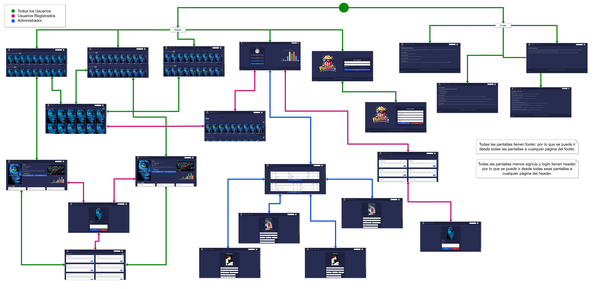

> Se puede entrar tanto por la página de Login como por la Principal (muestra las películas). Todas las páginas excepto Login y SignUp pueden navegar a través del header y footer. Las dos mencionadas solo por el footer.

### **Capturas de Pantalla y Descripción de Páginas**

#### **1. Página principal / Home**


> Página de inicio, en la cual se podrán ver una serie de películas seleccionadas por el sistema, dividas por categorias, con la posibilidad de ver más peliculas de ese tipo y el detalle de cada una. 

#### **2. Series**


> Página igual a la principal, pero con la diferencia que se ven series.

#### **3. Listas del sistema**


> Página en la que se muestran las listas generadas por el sistema, dando la posibilidad de ver en detalle cada lista, es decir, ver las peliculas o series que la componen.

#### **4. Iniciar Sesión**
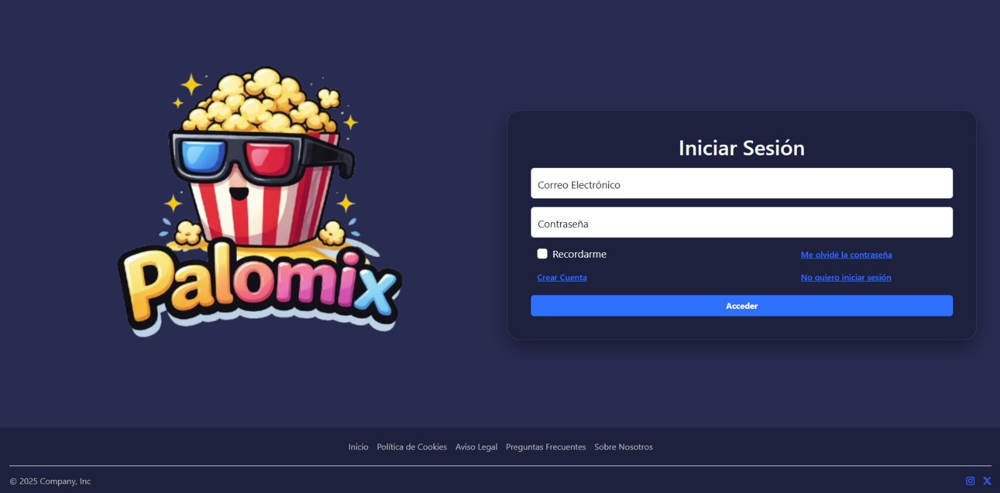

> Página dedicada a que el usuario inicie sesión en su cuenta, también puede entrar como anónimo, crearse una cuenta o seleccionar la opción de "Olvidé la contraseña".
#### **5. Crear Cuenta**
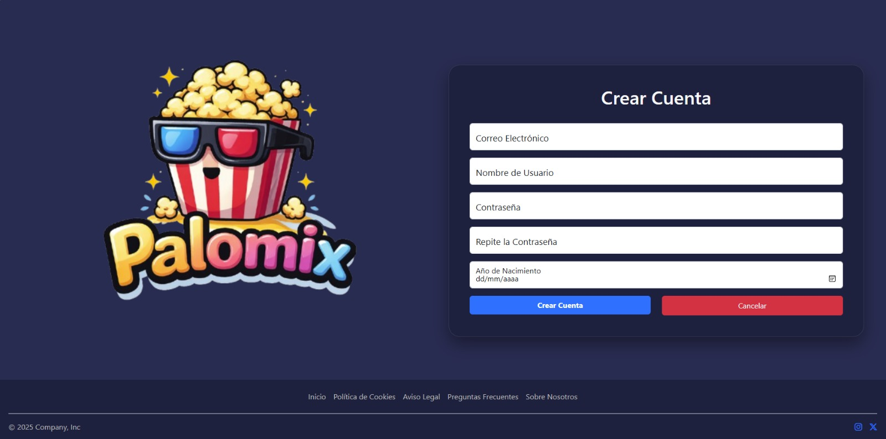

> Página dedicada a que el usuario se cree una cuenta, obligándolo a completar todos los campos, con los formatos correctos.

#### **6. Perfil**


> Página en la que el usuario podrá ver o editar su perfil, es decir, sus datos, además de que puede ver sus listas, hechas por él, y en el caso de que tenga permisos de administrador, acceder a dicha sección.

#### **7. Detalles de las listas**
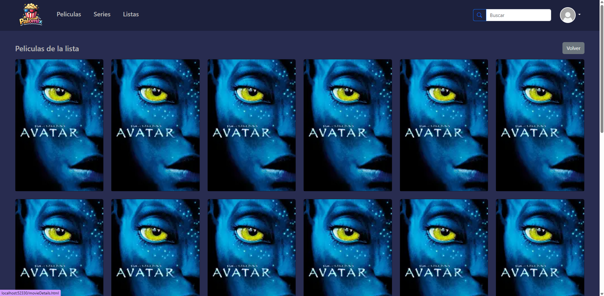

> Página donde se muestran todas las películas o series que componen una lista, con la posibilidad de acceder al detalle de cada una de ellas. 

#### **8. Detalles de las películas**


> Página de detalle de una película, donde se muestra toda la información de la película, como su sinopsis, año de estreno, duración, etc. Además, se muestran las valoraciones que tiene la película y el usuario puede añadir su propia valoración. También se encuentra un trailer, un botón para añadir la película a una lista y un botón para ver las reseñas de la película. 

#### **9. Detalles de las series**


> Página de detalle de una serie, con la misma información que la página de detalle de una película, pero con la diferencia de que se muestra el número de temporadas, en lugar de la duración. 

#### **10. Añadir reseña**


> Página en la que se muestra la cartelera de la película/serie y se puede añadir una valoración y una reseña escrita.

#### **11. Reseñas**


> Página en la que se muestran una lista de todas las reseñas de una película/serie. De cada reseña se tiene su valoración y su reseña escrita además del nombre del usuario que la escribió.

#### **12. Mis listas**
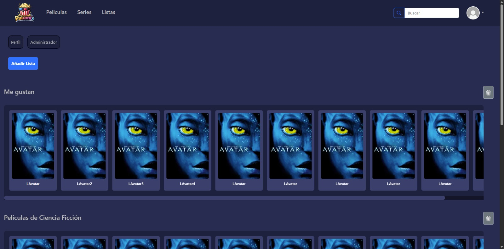

> Página donde los usuarios pueden ver las listas que han creado, con la posibilidad de acceder a cada una de ellas para ver su contenido o eliminarla.

#### **13. Mis reseñas**


> Página donde los usuarios pueden ver las reseñas que han creado, con la posibilidad de acceder a cada una de ellas para ver su contenido, modificarla o eliminarla.

#### **14. Modificar reseña**


> Página donde se muestra una reseña que ya ha sido escrita y que el usuario quiere modificar. Se puede modificar tanto la puntuación como la parte escrita.

#### **15. Administrador**


> Página donde el administrador puede editar y eliminar usuarios, películas, series, y listas tanto del sistema como de cada usuario. Además se pueden añadir series y películas. En la parte inferior, se encuentra un gráfico con los géneros.

#### **16. Añadir película**
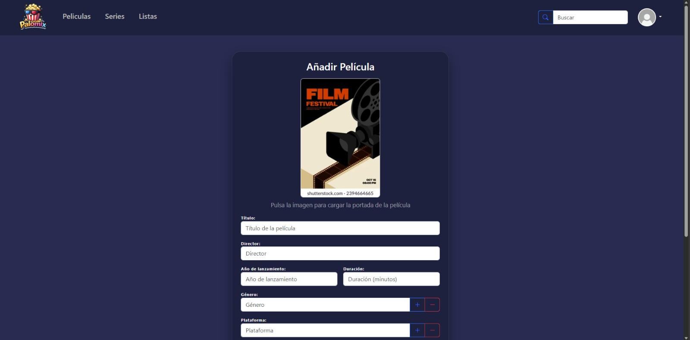

> Página de creación de películas, con un formulario para introducir los datos de la película, como el título, la sinopsis, el año de estreno, etc.

#### **17. Modificar película**


> Página de modificación de películas, con un formulario para editar los mismos datos que se añaden en la página de creación de películas, pero con los campos ya rellenados con la información actual de la película que se va a modificar.

#### **18. Añadir serie**
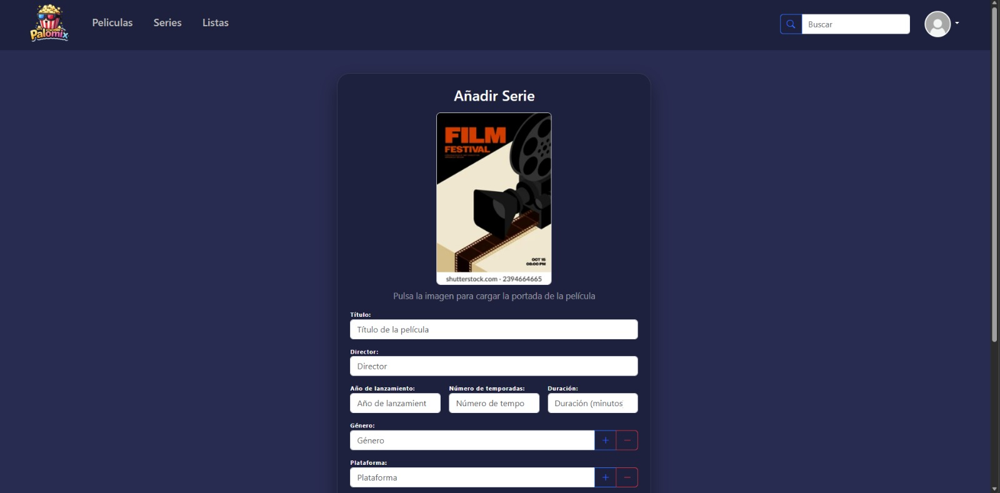

> Página de creación de series, con un formulario para introducir los datos de la serie, como el título, la sinopsis, el año de estreno, etc.

#### **19. Modificar series**


> Página de modificación de series, funciona igual que la de las películas, pero con los campos correspondientes a las series, como el número de temporadas.

#### **20. Políticas de cookies**
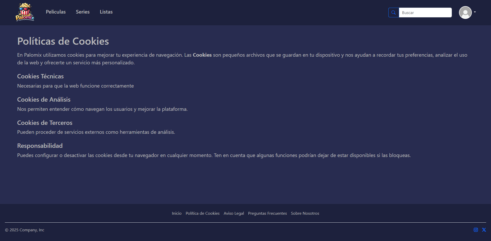

> Página con información sobre las políticas de cookies de la aplicación, explicando qué tipos de cookies se utilizan, su finalidad.

#### **21. Aviso legal**
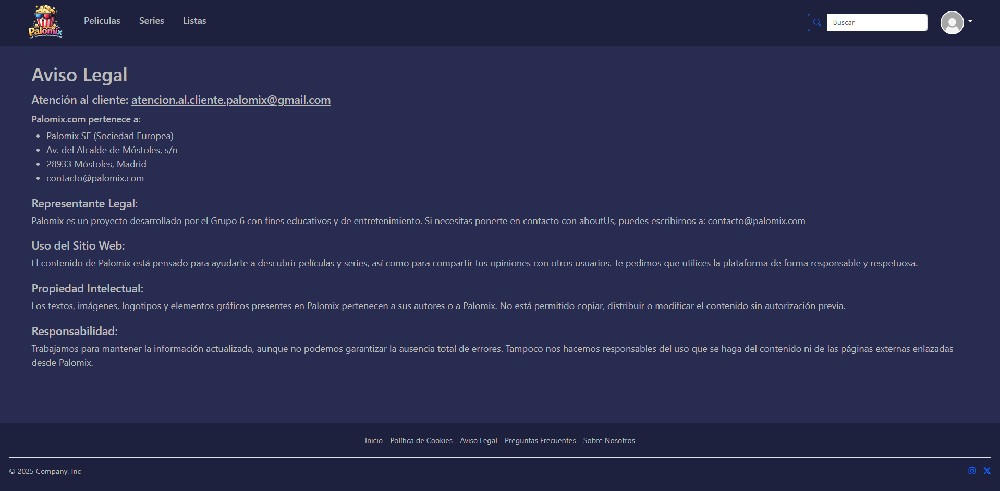

> Página con información legal sobre la aplicación, incluyendo términos de uso, propiedad intelectual y responsabilidad.

#### **22. Preguntas Frecuentes**


> Página en la que se muestran las preguntas frecuentes de los usuarios, con su respuesta correspondiente, para resolver dudas comunes sobre el funcionamiento de la aplicación.

#### **23. Sobre nosotros**


> Página en la que se explica quiénes somos y qué hacemos.


### **Participación de Miembros en la Práctica 1**


#### **Alumno 1 - [Matias Maccarrone]**
- **HTML (principal, series, lists, login, signUp)**
Creé las páginas principales de la app: la pantalla de inicio con secciones de películas/series/listas, las páginas de login y registro con formularios validados, y la estructura de navegación común con navbar y footer.

- **JavaScript (searchFunc, loadMoviesSeriesLists)**
Implementé la búsqueda en tiempo real que filtra películas, series y listas mostrando resultados o un mensaje de error, y la carga dinámica de contenido que detecta en qué página está el usuario y rellena las tarjetas correspondientes.

- **JavaScript (signUpLogin)**
Desarrollé la lógica de login con validación de email y contraseña, y el registro de nuevos usuarios con verificación de campos, coincidencia de contraseñas y validación de fecha de nacimiento. 

| Nº    | Commits      | Files      |
|:------------: |:------------:| :------------:|
|1| [Creación de la página Login y SignUp, aunque se modificaron por diversos errores, la estructura de la página es esta ](https://github.com/CodeURJC-SSDD-2025-26/ssdd-2025-26-project-base/commit/8672d33d09f2f68f70b09845726ffb1172b8ca70#diff-f7df8ca1f6a5b4e55cc08d43d079af1235a1a87cf8799fe7813f42440378ef4a)  | [login.html](https://github.com/CodeURJC-SSDD-2025-26/practica-ssdd-2025-26-grupo-6/blob/main/login.html), [signUp.html](https://github.com/CodeURJC-SSDD-2025-26/practica-ssdd-2025-26-grupo-6/blob/readMe-maty/signUp.html)   |
|2| [Creación de la página de Peliculas, Series y Listas, por más que se corrigieron varias veces, la forma de las páginas es la misma en el resultado final](https://github.com/CodeURJC-SSDD-2025-26/ssdd-2025-26-project-base/commit/3ecd2a792b263776659ef8de694abdffca2ba486)  | [principal.html](https://github.com/CodeURJC-SSDD-2025-26/practica-ssdd-2025-26-grupo-6/blob/main/principal.html), [series.html](https://github.com/CodeURJC-SSDD-2025-26/practica-ssdd-2025-26-grupo-6/blob/main/series.html), [listas.html](https://github.com/CodeURJC-SSDD-2025-26/practica-ssdd-2025-26-grupo-6/blob/main/lists.html) |
|3| [Creación del Header y Footer de las páginas, luego se agregó un menú dropdown en el perfil pero la estructura general se conservó](https://github.com/CodeURJC-SSDD-2025-26/ssdd-2025-26-project-base/commit/fa2bbbf3ee648cd8114fd858f4e05062e318f94e)  | [principal.html](https://github.com/CodeURJC-SSDD-2025-26/practica-ssdd-2025-26-grupo-6/blob/main/principal.html)   |
|4| [Adición de distintas funciones con javaScript, tales como, filtros para el login o signUp, el permitir agregar nueva filmografia con solo escribir sus datos en una estructura en el fichero .js, y que funcione la barra de búsqueda de la cabecera. Estas funcionalidades fueron separadas para más claridad y errores que habían. (El link del commit es el primer código)](https://github.com/CodeURJC-SSDD-2025-26/ssdd-2025-26-project-base/commit/d25cedeb38bed0ac17684903221b7cc5615c1724#diff-d455aa836573252d1dfd9da86558c49ddb9cd10a62efae8093bfad90552a0a7a)  | [loadMoviesSeriesList.js](https://github.com/CodeURJC-SSDD-2025-26/practica-ssdd-2025-26-grupo-6/blob/main/js/loadMoviesSeriesLists.js), [loginSignUp.js](https://github.com/CodeURJC-SSDD-2025-26/practica-ssdd-2025-26-grupo-6/blob/main/js/signUpLogin.js)   |
|5| [Funcionamiento completo de la barra de búsqueda del header mediante javaScript. (El link del commit es de la primera implementación, luego se separó y corrigió)](https://github.com/CodeURJC-SSDD-2025-26/ssdd-2025-26-project-base/commit/15bfdacc1929677929eafd81bbcaca917341c7e6)  | [searchFunc.js](https://github.com/CodeURJC-SSDD-2025-26/practica-ssdd-2025-26-grupo-6/blob/main/js/searchFunc.js)    |

---

#### **Alumno 2 - [Alejandro Carretero Badorrey]**

- **Responsable del Perfil**: Responsable principal del perfil (profile), 
administrador(administrator) y de mis listas (myLists).
- **Responsable de hacer los gráficos**: Responsable de hacer todos los gráficos de la página web y de su funcionamiento.
- **Responsable de hacer el JavaScript de editar perfil**: Responsable de hacer que en perfil le des al boton de editar y que con JavaScript te haga que sea un formulario.
- **Responsable de hacer el JavaScript de foto del perfil**: Responsable de hacer que en perfil le des a la foto y que con JavaScript puedas elegir la foto que usar como avatar.

| Nº    | Commits      | Files      |
|:------------: |:------------:| :------------:|
|1| [Hacer en una card todo el perfil, además de añadir en el boton de editar perfil que al pulsarle se convierte en un formulario](https://github.com/CodeURJC-SSDD-2025-26/ssdd-2025-26-project-base/commit/d3d2355a1a59484d6f16bd0a35c57e93410c377c)  | [profile.html](https://github.com/CodeURJC-SSDD-2025-26/practica-ssdd-2025-26-grupo-6/blob/main/profile.html)   |
|2| [En esta parte lo que hice fue añadir al administrador todas las tablas(Usuarios, películas, series, listas) ](https://github.com/CodeURJC-SSDD-2025-26/ssdd-2025-26-project-base/commit/2055de7fbdffecc0dc41de7f8affed152ff5a86d)  | [administrator.html](https://github.com/CodeURJC-SSDD-2025-26/practica-ssdd-2025-26-grupo-6/blob/main/administrator.html)   |
|3| [En esta parte se hicieron todos los modales de las tablas, para ver el detalle ampliado de cada tabla](https://github.com/CodeURJC-SSDD-2025-26/ssdd-2025-26-project-base/commit/70ebd9e13e9237c0b4211e9ce95e1238a70e22a1)  | [administrator.html](https://github.com/CodeURJC-SSDD-2025-26/practica-ssdd-2025-26-grupo-6/blob/main/administrator.html)   |
|4| [En esta parte implementé todos los gráficos de la aplicación web](https://github.com/CodeURJC-SSDD-2025-26/ssdd-2025-26-project-base/commit/3340fa52294c86cba4362b511cf158a1e9623e65)  | [filmsRatingBarChart.js](https://github.com/CodeURJC-SSDD-2025-26/practica-ssdd-2025-26-grupo-6/blob/main/js/filmsRatingBarChart.js )   |
|5| [En esta parte se creó la página myLists que es una página en el perfil con la cual puedes ver todas tus listas](https://github.com/CodeURJC-SSDD-2025-26/ssdd-2025-26-project-base/commit/34af3952fccf0b5c356cb6fc156016eb3c624d9d)  | [myLists.html](https://github.com/CodeURJC-SSDD-2025-26/practica-ssdd-2025-26-grupo-6/blob/main/myLists.html)   |

---

#### **Alumno 3 - [Raúl Sánchez López]**

- **Creación del boceto inicial**: Responsable de la creación de los primeros diseños a mano para facilitar la creación de las páginas a partir de ellos.

- **Encargado de la parte de las reseñas**: Responsable de las páginas de creación de reseñas y la página donde aparece una lista con todas las reseñas de una película/serie.

- **Encargado de las películas de una lista**: Responsable de la página donde aparecen todas las películas de una lista.

- **Encargado de algunos JavaScript**: Responsable de los javaScript de las estrellas para valorar una reseña y de las reseñas.

| Nº    | Commits      | Files      |
|:------------: |:------------:| :------------:|
|1| [Acabé de modificar la primera versión de crear una reseña, aunque más tarde hice algún que otro cambio, la tarjeta es la misma](https://github.com/CodeURJC-SSDD-2025-26/ssdd-2025-26-project-base/commit/b43bfb4ccaa7e6fcfd1262b330a370347dc79f20)  | [includeReview.html](https://github.com/CodeURJC-SSDD-2025-26/practica-ssdd-2025-26-grupo-6/blob/main/includeReview.html)   |
|2| [Creación de la página con todas las reseñas y alguma modificación más en crear reseña](https://github.com/CodeURJC-SSDD-2025-26/ssdd-2025-26-project-base/commit/2f8bdf82526cd1b2cc613782a092b8c713d9768f#diff-fc1d1529408fbdebd756dd226f267317322dc3c5bc3ff8b7260d3027f4de3bee)  | [review.html](https://github.com/CodeURJC-SSDD-2025-26/practica-ssdd-2025-26-grupo-6/blob/main/review.html)   |
|3| [Creación del javaScript para que funcionen las estrellas en la creación de reseñas y se acaba esta página por completo](https://github.com/CodeURJC-SSDD-2025-26/ssdd-2025-26-project-base/commit/d482de94b1501d59c7b369e68cc04e98fb9f4dca#diff-10afc71f0751edab19c29f84d6f37c1c743eab2c2810c7775e07bb1db73e0ea6)  | [stars.js](https://github.com/CodeURJC-SSDD-2025-26/practica-ssdd-2025-26-grupo-6/blob/main/js/stars.js)   |
|4| [Creación del javaScript para que se pueda usar el modal de reseñas y modificación de la página de reseñas](https://github.com/CodeURJC-SSDD-2025-26/ssdd-2025-26-project-base/commit/83137c9c862ffe687b5b56f6ca2041e4ed0222e1#diff-10afc71f0751edab19c29f84d6f37c1c743eab2c2810c7775e07bb1db73e0ea6)  | [reviews.js](https://github.com/CodeURJC-SSDD-2025-26/practica-ssdd-2025-26-grupo-6/blob/main/js/reviews.js)   |
|5| [Creación de la página de las películas de una lista](https://github.com/CodeURJC-SSDD-2025-26/ssdd-2025-26-project-base/commit/4c61f1ca1a45ab413a7be55ccc3e1ca11026f4dc)  | [filmsLists](https://github.com/CodeURJC-SSDD-2025-26/practica-ssdd-2025-26-grupo-6/blob/main/filmsLists.html)   |

---

#### **Alumno 4 - [Carla García Romero]**

- **Desarrollo del Módulo Multimedia**: Responsable principal de las vistas de películas y series, 
incluyendo la gestión de datos (includeMovie/Review, modifyMovie/Review) y la visualización 
detallada (movieDetails, seriesDetails).

- **Actualización de Secciones Corporativas**: Rediseño y homogeneización de formato de las páginas 
informativas y legales (legalAdvise, aboutUs, cookies y frequentlyAskedQuestions).

- **Colaboración Técnica**: Participación activa en la revisión de código grupal, optimización de 
interfaces y resolución conjunta de incidencias durante el desarrollo.

| Nº    | Commits      | Files      |
|:------------: |:------------:| :------------:|
|1| [Cambios y modificación a las pantallas de películas y series. También hay otros cambios de otras páginas y se añade JavaScript](https://github.com/CodeURJC-SSDD-2025-26/practica-ssdd-2025-26-grupo-6/commit/77e5cdc5dc04c42490edea21d8b34345c8a6dc97)  | [modifyMovie.html](https://github.com/CodeURJC-SSDD-2025-26/practica-ssdd-2025-26-grupo-6/blob/main/modifyMovie.html), [modifySeries.html](https://github.com/CodeURJC-SSDD-2025-26/practica-ssdd-2025-26-grupo-6/blob/main/modifySeries.html), [includeSerie.html](https://github.com/CodeURJC-SSDD-2025-26/practica-ssdd-2025-26-grupo-6/blob/main/includeSerie.html), [includeMovie.html](https://github.com/CodeURJC-SSDD-2025-26/practica-ssdd-2025-26-grupo-6/blob/main/includeMovie.html)  |
|2| [Modificación de las pantallas de información y cambio de nombre a inglés](https://github.com/CodeURJC-SSDD-2025-26/practica-ssdd-2025-26-grupo-6/commit/24db8430888d18fbd804e784de7d0ff08855627d)  | [frequentlyAskedQuestions.html](https://github.com/CodeURJC-SSDD-2025-26/practica-ssdd-2025-26-grupo-6/blob/main/frequentlyAskedQuestions.html), [legalAdvise.html](https://github.com/CodeURJC-SSDD-2025-26/practica-ssdd-2025-26-grupo-6/blob/main/legalAdvise.html), [aboutUs.html](https://github.com/CodeURJC-SSDD-2025-26/practica-ssdd-2025-26-grupo-6/blob/main/aboutUs.html), [cookies.html](https://github.com/CodeURJC-SSDD-2025-26/practica-ssdd-2025-26-grupo-6/blob/main/cookies.html)  |
|3| [Mejora del css y eliminación de clases innecesarias](https://github.com/CodeURJC-SSDD-2025-26/practica-ssdd-2025-26-grupo-6/commit/1e7dd0a1a3f7d62e25b32c1403f44cc3186e00df)  | [styles.css](https://github.com/CodeURJC-SSDD-2025-26/practica-ssdd-2025-26-grupo-6/blob/main/styles.css)   |
|4| [Solución del problema con el footer y añadido de modal](https://github.com/CodeURJC-SSDD-2025-26/practica-ssdd-2025-26-grupo-6/commit/641e8da3a68a7dee9a56fd4b7ac4b74ff74a4160)  | [movieDetails.html](https://github.com/CodeURJC-SSDD-2025-26/practica-ssdd-2025-26-grupo-6/blob/main/movieDetails.html)   |

---

## 🛠 **Práctica 2: Web con HTML generado en servidor**

### **Navegación y Capturas de Pantalla**

#### **Diagrama de Navegación**

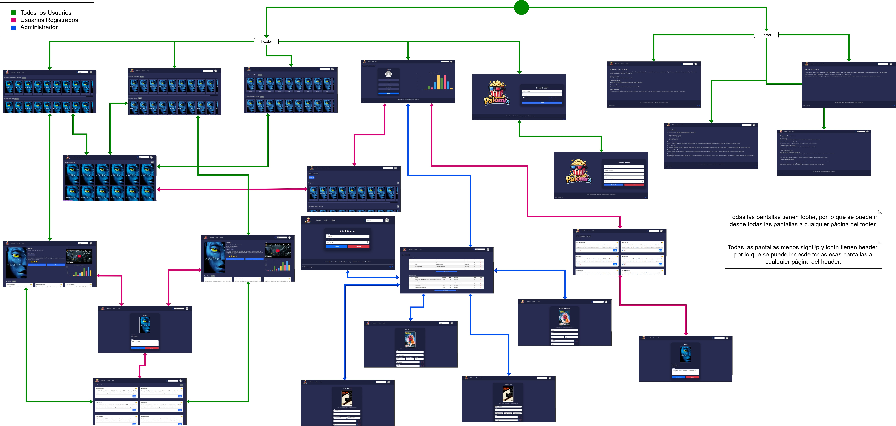

> El único cambio que tuvo, fue el de agregar la pantalla de creación del Director, que va desde el apartado de administrador, por lo cual, solo es accesible por el mismo.

#### **Capturas de Pantalla Actualizadas**

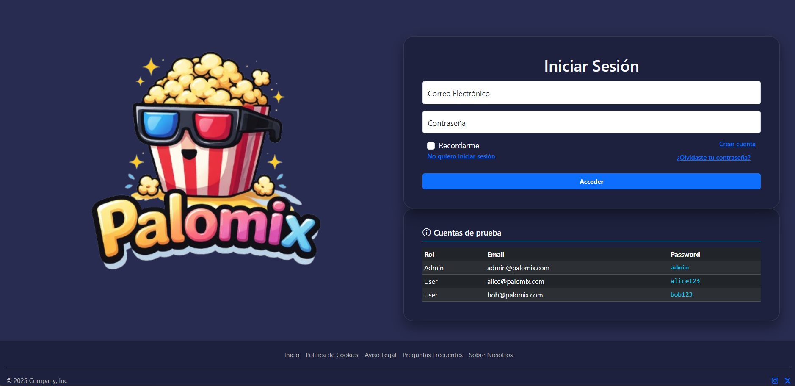
> Se le agregó una tabla debajo para tener un mejor acceso a los datos mínimos para probar la aplicación

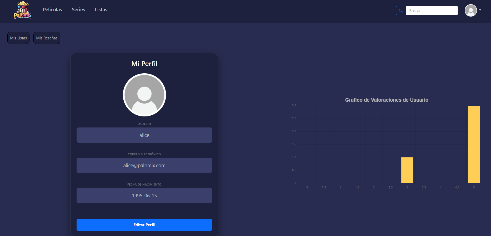
> La diferencia es que el usuario no puede ver el botón de Administrador,

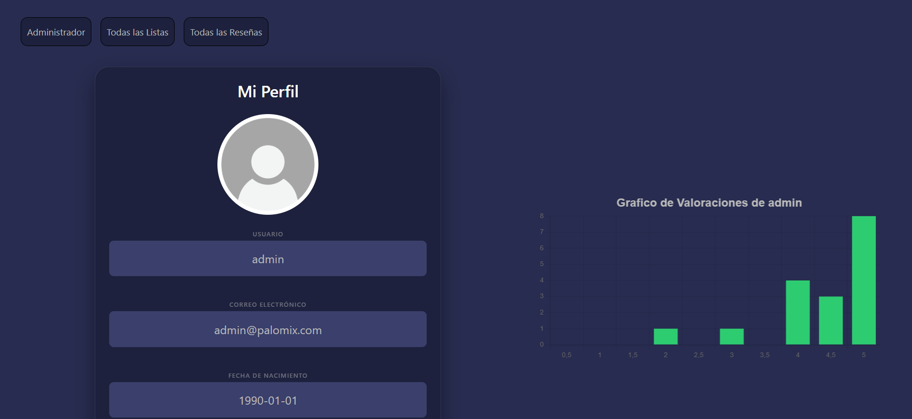
> La diferencia es que el administrador, puede acceder al apartado de administración, y que los otros botones muestran las listas del sistema y todas las reseñas de la aplicación.

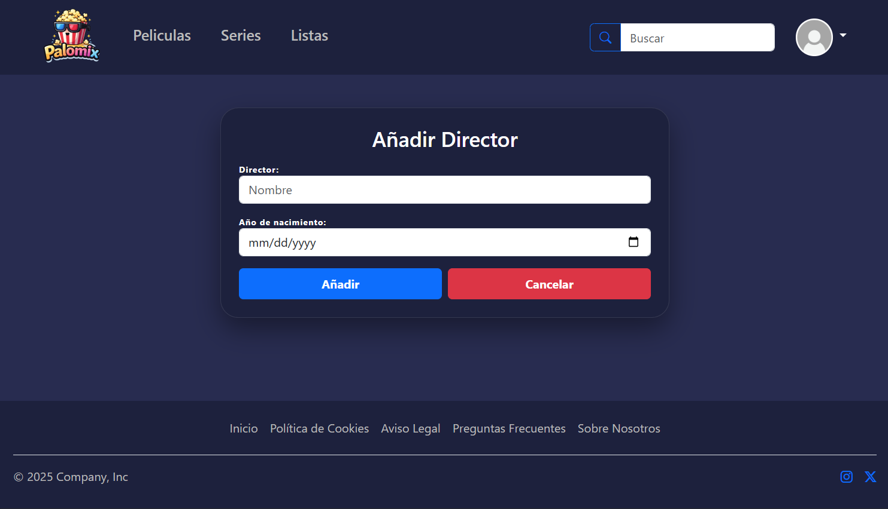
> Es la pantalla dedicada a la creación de la entidad Director, la cual será utilizada por filmography.


### **Instrucciones de Ejecución**

#### **Requisitos Previos**
- **Java**: versión 21 o superior
- **Maven**: versión 3.8 o superior
- **MySQL**: versión 8.0 o superior
- **Git**: para clonar el repositorio

#### **Pasos para ejecutar la aplicación**

1. **Clonar el repositorio**
   ```bash
   git clone https://github.com/CodeURJC-SSDD-2025-26/practica-ssdd-2025-26-grupo-6.git
   cd practica-ssdd-2025-26-grupo-6
   mvn spring-boot:run
   ```

2. **SIGUIENTES PASOS**  
Cuando se inicia la aplicación, se tiene que asegurar que la URL dice "https://localhost:8443/", como mínimo.
Por defecto, se dirigirá a la pantalla de Login, en la cual se podrá acceder utilizando las credenciales que vienen a continuación.


#### **Credenciales de prueba**
- **Administrador**: usuario: `admin@palomix.com`, contraseña: `admin`
- **Usuario Registrado**: usuario: `alice@palomix.com`, contraseña: `alice123`
- **Usuario Anónimo**: Haciendo click en "No quiero iniciar sesión" en Login.

### **Diagrama de Entidades de Base de Datos**

Diagrama mostrando las entidades, sus campos y relaciones:

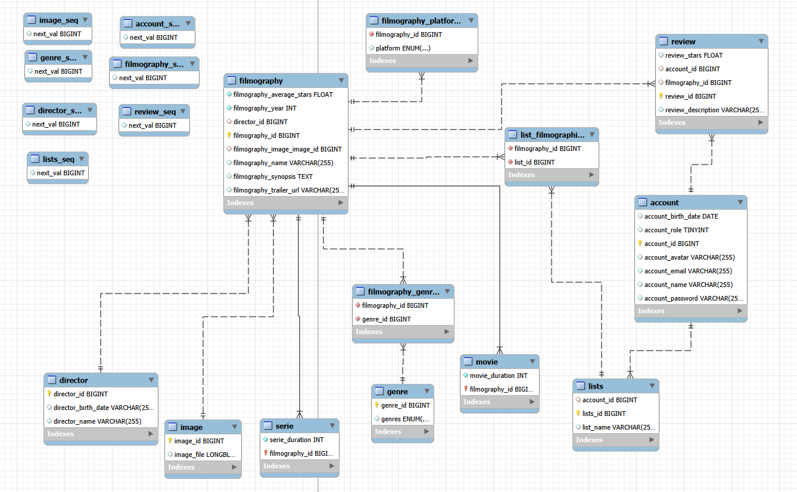

> En el diagrama se ven las entidades principales (filmography, account y review) con sus respectivas relaciones, tanto las de herencia entre filmography con movie y serie, como las relaciones debido a las claves ajenas, como lists con account.

### **Diagrama de Clases y Templates**

Diagrama de clases de la aplicación con diferenciación por colores o secciones:

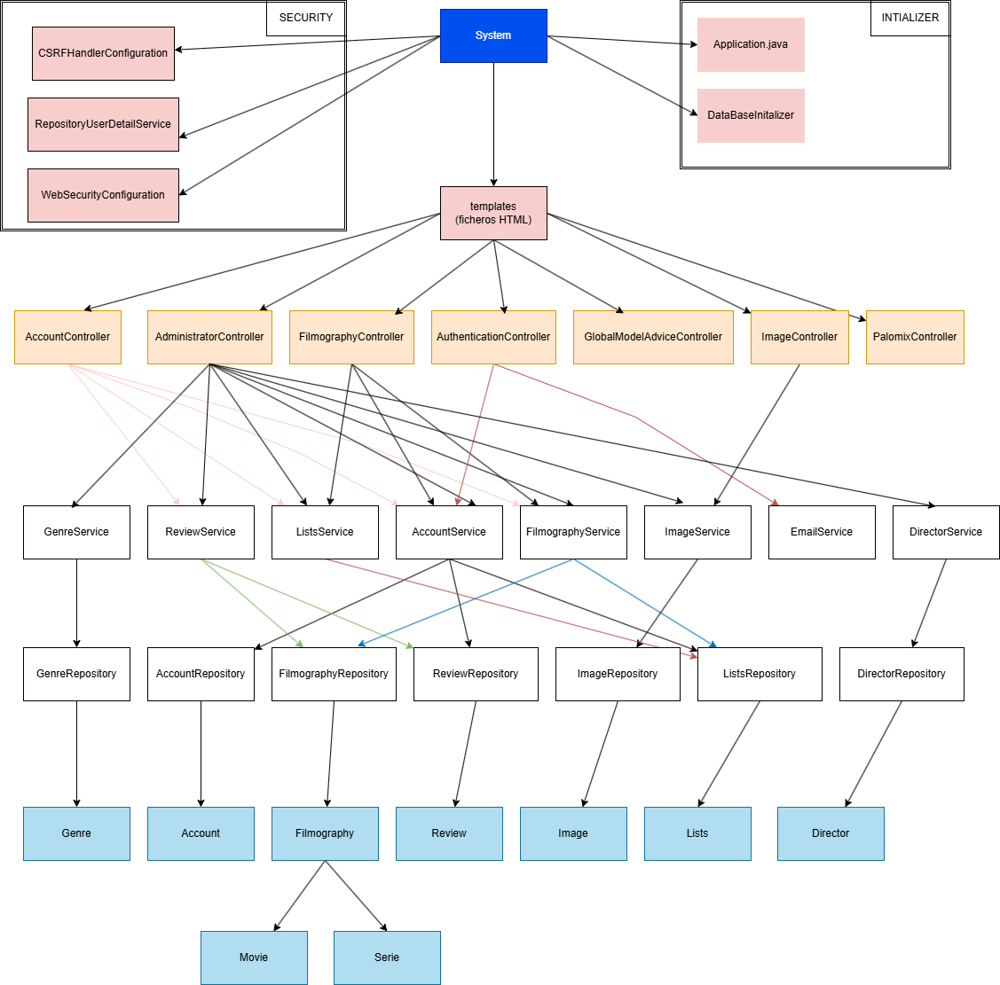

> Este diagrama representa la arquitectura de nuestra aplicación, siguiendo el patrón de diseño por capas. Teniendo una capa de controladores, repositorios, servicios y modelos. Al igual de la sección de seguridad e inicializadores de la app. 

### **Participación de Miembros en la Práctica 2**

#### **Alumno 1 - [Matias Maccarrone]**

- **Gestión de Usuarios**: Implementacion de los apartados de Login y SignUp, incluyendo mensajes de error y controles de escritura.
- **Servicio de Mensajería**: Integración del servicio de correo electrónico automático, para los casos de confirmación de registro de usuario y de recuperación de contraseña. Utilizando el JavaMailSender y STMP, con una cuenta de Gmail propia.
- **Sección del Usuario**: Desarrollo de los apartados donde el usuario puede visualizar y modificar tanto sus listas, como sus reseñas. Y para el caso del administrador, visualizará las listas del sistema, pudiéndolas modificar, y todas las reseñas del sistema, habilitándolo a modificarlas e identificar al dueño de la misma. Todo esta sección tiene control de acceso y dueño de objeto.
- **Barra de Búsqueda**: Creación de una barra de búsqueda que permite a cualquier usuario a buscar películas o series, por su nombre o género, y devuelve la filmografía que coincida (parcial o totalmente) con la búsqueda, al igual que la que coincida con el género de la búsqueda
- **Implementación de Seguridad y Páginas de Error**: Fui encargado de la seguridad con Spring Security y desarrollé las páginas de error.

| Nº    | Commits      | Files      |
|:------------: |:------------:| :------------:|
|1| [Primera implementación del Login y SignUp](https://github.com/CodeURJC-SSDD-2025-26/practica-ssdd-2025-26-grupo-6/commit/83c1a1f315749bfb9708d09a5fec6323f022f38c)  | [Login.html](https://github.com/CodeURJC-SSDD-2025-26/practica-ssdd-2025-26-grupo-6/blob/main/practica2/src/main/resources/templates/login.html) - [SignUp.html](https://github.com/CodeURJC-SSDD-2025-26/practica-ssdd-2025-26-grupo-6/blob/main/practica2/src/main/resources/templates/signUp.html)   |
|2| [Primera implementación del servicio de correo](https://github.com/CodeURJC-SSDD-2025-26/practica-ssdd-2025-26-grupo-6/commit/9484d2e81fe7c49ba7fc35edfb19a7803ee71438)  | [EmailService.java](https://github.com/CodeURJC-SSDD-2025-26/practica-ssdd-2025-26-grupo-6/blob/main/practica2/src/main/java/es/code/urjc/practica2/service/EmailService.java)   |
|3| [Primera implementación de myLists y myReviews](https://github.com/CodeURJC-SSDD-2025-26/practica-ssdd-2025-26-grupo-6/commit/011f90c15d65fb05dc4e96dd9ca21fa6d508b062)  | [myLists.html](https://github.com/CodeURJC-SSDD-2025-26/practica-ssdd-2025-26-grupo-6/blob/main/practica2/src/main/resources/templates/myLists.html) - [myReviews.html](https://github.com/CodeURJC-SSDD-2025-26/practica-ssdd-2025-26-grupo-6/blob/main/practica2/src/main/resources/templates/myReviews.html)  |
|4| [Primera implementación de la barra de búsqueda](https://github.com/CodeURJC-SSDD-2025-26/practica-ssdd-2025-26-grupo-6/commit/0adac643ad333c483005aeaf3413cd28dd13e038)  | [searchBar.html](https://github.com/CodeURJC-SSDD-2025-26/practica-ssdd-2025-26-grupo-6/blob/main/practica2/src/main/resources/templates/searchBar.html)   |
|5| [Primera implementación de seguridad](https://github.com/CodeURJC-SSDD-2025-26/practica-ssdd-2025-26-grupo-6/commit/1dd8f30d377d57fb383b718aae29f12065189cc9), [Desarrollo de las páginas de error](https://github.com/CodeURJC-SSDD-2025-26/practica-ssdd-2025-26-grupo-6/commit/d2a9e92d5ef8a9c6bae877460c6393b39a075e06)  | [Security](https://github.com/CodeURJC-SSDD-2025-26/practica-ssdd-2025-26-grupo-6/tree/main/practica2/src/main/java/es/code/urjc/practica2/security) - [ErrorPages](https://github.com/CodeURJC-SSDD-2025-26/practica-ssdd-2025-26-grupo-6/tree/main/practica2/src/main/resources/templates/error)  |

---

#### **Alumno 2 - [Alejandro Carretero Badorrey]**

- **Perfil de Usuario**: Fui el encargado de implementar el perfil del usuario, además de gestionar el avatar, asegurando que el avatar se mantenga en el encabezado de todas las pantallas mientras se encuentre la sesión del usuario activa.

- **Gestión de Directores**: Desarrollé la página de directores tanto para crear como modificar la entidad de directores.

- **Panel de Administrador**: He desarrollado la pantalla de administrador que muestra tablas que recogen la información de las entidades (usuarios, películas, series, listas del sistema y directores) permitiendo su visualización y modificación.

- **Edición y borrado de entidades**: He trabajado para que desde la página de administrador se puedan editar y borrar entidades (usuarios, películas, series, listas del sistema y directores), además de poder visualizar, modificar y borrar las listas de usuarios y las reseñas. 
  
- **Gráficos**: He trabajado en las pantallas de filmografía, perfil y administrador para que los gráficos reflejen los datos reales de la base de datos.

| Nº    | Commits      | Files      |
|:------------: |:------------:| :------------:|
|1| [Cambios en el perfil](https://github.com/CodeURJC-SSDD-2025-26/practica-ssdd-2025-26-grupo-6/commit/11eb44d35ddf63ea2ffa29ad6d269a911d7d2bb5)  | [profile.html](https://github.com/CodeURJC-SSDD-2025-26/practica-ssdd-2025-26-grupo-6/blob/main/practica2/src/main/resources/templates/profile.html)   |
|2| [Gestión de Directores](https://github.com/CodeURJC-SSDD-2025-26/practica-ssdd-2025-26-grupo-6/commit/3ac4d86c0e7783dfd96da3bc7c215b172758f883)  | [directorForm.html](https://github.com/CodeURJC-SSDD-2025-26/practica-ssdd-2025-26-grupo-6/blob/main/practica2/src/main/resources/templates/directorForm.html)   |
|3| [Panel de Administrador*](https://github.com/CodeURJC-SSDD-2025-26/practica-ssdd-2025-26-grupo-6/commit/15764f9ebefe7840f9c11da57e65b4b0236c1bdc)  | [administrator.html](https://github.com/CodeURJC-SSDD-2025-26/practica-ssdd-2025-26-grupo-6/blob/main/practica2/src/main/resources/templates/administrator.html)   |
|4| [Edición y borrado de entidades](https://github.com/CodeURJC-SSDD-2025-26/practica-ssdd-2025-26-grupo-6/commit/f59202a8198b4da182629cd51c1f48a2d4e42c17)  | [administrator.html](https://github.com/CodeURJC-SSDD-2025-26/practica-ssdd-2025-26-grupo-6/blob/main/practica2/src/main/resources/templates/administrator.html)   |
|5| [Gráficos](https://github.com/CodeURJC-SSDD-2025-26/practica-ssdd-2025-26-grupo-6/commit/f832c430acf58852adbff4e0d4ec292c63d72f6c)  | [profile.html](https://github.com/CodeURJC-SSDD-2025-26/practica-ssdd-2025-26-grupo-6/blob/main/practica2/src/main/resources/templates/profile.html), [administrator.html](https://github.com/CodeURJC-SSDD-2025-26/practica-ssdd-2025-26-grupo-6/blob/main/practica2/src/main/resources/templates/administrator.html), [filmographyDetails.html](https://github.com/CodeURJC-SSDD-2025-26/practica-ssdd-2025-26-grupo-6/blob/main/practica2/src/main/resources/templates/filmographyDetails.html)  |

---

#### **Alumno 3 - [Raúl Sánchez López]**

- **Rediseño de la Página Principal y de Series**: He organizado estas secciones para que el contenido aparezca dividido por géneros. Además, he creado un apartado específico de "Añadidos recientemente" para que el usuario pueda ver las últimas novedades de la plataforma nada más entrar.

- **Sistema de Listas y Ordenación**: Me he encargado de la página de listas de usuarios, implementando diferentes formas de organizarlas. Por ejemplo, se pueden ordenar basándose en la valoración media de las películas y series que contienen.

- **Visualización de Contenido de Listas**: He desarrollado la pantalla que muestra los títulos que hay dentro de una lista específica, funcionando tanto para las listas automáticas del sistema (como las de géneros) como para las que crean los propios usuarios.

- **Sección de Reseñas Detalladas**: He trabajado en la página donde se muestran todas las reseñas de una película o serie concreta, permitiendo que los usuarios consulten las valoraciones de la comunidad.

- **Ajustes Técnicos y Estructura**: Para que todo lo anterior funcione, he realizado los cambios necesarios en todas las capas internas del programa (modelos, repositorios, controladores y servicios), asegurándome de que la información se guarde y se muestre correctamente en cada sección.

| Nº    | Commits      | Files      |
|:------------: |:------------:| :------------:|
|1| [Primeros cambios en la pantalla principal y la de series](https://github.com/CodeURJC-SSDD-2025-26/practica-ssdd-2025-26-grupo-6/commit/ec286ad54d0d9476efbba8b02ce8c3e9ac587da0)  | [principal.html](https://github.com/CodeURJC-SSDD-2025-26/practica-ssdd-2025-26-grupo-6/blob/main/practica2/src/main/resources/templates/principal.html)   |
|2| [Modificación en la principal y en series de las películas y series ordenadas por generos](https://github.com/CodeURJC-SSDD-2025-26/practica-ssdd-2025-26-grupo-6/commit/6dffdfab748af6fd9a308499a252422ae4552e37)  | [series.html](https://github.com/CodeURJC-SSDD-2025-26/practica-ssdd-2025-26-grupo-6/blob/main/practica2/src/main/resources/templates/series.html)   |
|3| [Algunos cambios en series y principal y la modificación de filmslist](https://github.com/CodeURJC-SSDD-2025-26/practica-ssdd-2025-26-grupo-6/commit/ac24417deff698aba5b2c898cbf69db5f29ebd5d)  | [filmsLists.html](https://github.com/CodeURJC-SSDD-2025-26/practica-ssdd-2025-26-grupo-6/blob/main/practica2/src/main/resources/templates/filmsLists.html)   |
|4| [Modificación de lists y cambios en las imagenes](https://github.com/CodeURJC-SSDD-2025-26/practica-ssdd-2025-26-grupo-6/commit/447848e6f4c78f1d2bdf012f6d3ce3201b06ba17)  | [lists.htlm](https://github.com/CodeURJC-SSDD-2025-26/practica-ssdd-2025-26-grupo-6/blob/main/practica2/src/main/resources/templates/lists.html)   |
|5| [Realización de reviews](https://github.com/CodeURJC-SSDD-2025-26/practica-ssdd-2025-26-grupo-6/commit/314514e5d9c13edea563af7b704468137011b917)  | [review.html](https://github.com/CodeURJC-SSDD-2025-26/practica-ssdd-2025-26-grupo-6/blob/main/practica2/src/main/resources/templates/review.html)   |

---

#### **Alumno 4 - [Carla García Romero]**

- **Formularios y gestión de datos**: Me he encargado de unificar y modificar todos los formularios principales (filmographyForm, reviewForm). Así mismo, me he encargado de sus respectivas lógicas para el correcto funcionamiento de cada uno.
- **Detalles de las películas/series**: He desarrollado la página de detalles de series y peliculas usando mustache para que solo se necesite una página html. Junto con esto, me he encargado del correcto funcionamiento de las reseñas por cada película y de las listas a las que un usuario puede agregar dichas peliculas o series.
- **Entidad Imagen**: Tras gestionar las imágenes mediante enlaces en una primera aproximación, he introducido la entidad imagen para que estas fueran guardadas correctamente en la base de datos. 
- **Organización del diseño**: Tras revisar varias veces las páginas, reestructuré el Header, Footer y Head para evitar la repetición de código, modularizandolo de manera que fuera consistente para todas las páginas.
- **Cambio a SQL**: Realicé el cambio de la base de datos temporal H2 a MySQL. Además, contruí el DatabaseInitializer para poder ir viendo los cambios que se realizaban mientras modificábamos la base de datos.
- **Seguridad con Spring Security**: Junto a mi compañero Matías, implementamos la seguridad usando Spring Security. En este caso, fui la encargada de generar el certificado autofirmado y de crear las clases que apoyan la seguridad.


| Nº    | Commits      | Files      |
|:------------: |:------------:| :------------:|
|1| [Primeros cambios: formulario de películas y series](https://github.com/CodeURJC-SSDD-2025-26/practica-ssdd-2025-26-grupo-6/commit/59d579ebbf689fbd3828192b6145b5dab72bacbe) y [formulario de reseñas](https://github.com/CodeURJC-SSDD-2025-26/practica-ssdd-2025-26-grupo-6/commit/b6554b9e6c7d5606b6bcbc92f4fa7cad547fd5e4) | [filmographyForm.html](https://github.com/CodeURJC-SSDD-2025-26/practica-ssdd-2025-26-grupo-6/blob/main/practica2/src/main/resources/templates/filmographyForm.html), [reviewForm.html](https://github.com/CodeURJC-SSDD-2025-26/practica-ssdd-2025-26-grupo-6/blob/main/practica2/src/main/resources/templates/reviewForm.html)  |
|2| [Primera funcionalidad de los detalles de las filmografías](https://github.com/CodeURJC-SSDD-2025-26/practica-ssdd-2025-26-grupo-6/commit/62ce5cea4c85e1abbec4dee05957cf6ca1a34354)  | [filmographyDetails.html](https://github.com/CodeURJC-SSDD-2025-26/practica-ssdd-2025-26-grupo-6/blob/main/practica2/src/main/resources/templates/filmographyDetails.html)   |
|3| [Añadido de la entidad imagen](https://github.com/CodeURJC-SSDD-2025-26/practica-ssdd-2025-26-grupo-6/commit/2daaa0b9c8aeb61a1e8f56fa0a6f38f0569c0edb)  | [Image.java](https://github.com/CodeURJC-SSDD-2025-26/practica-ssdd-2025-26-grupo-6/blob/main/practica2/src/main/java/es/code/urjc/practica2/model/Image.java)   |
|4| [Reestructuración de header, footer y head](https://github.com/CodeURJC-SSDD-2025-26/practica-ssdd-2025-26-grupo-6/commit/210936b5c0d6e5cb572baac08d4d749b7ea27705)  | [header.html](https://github.com/CodeURJC-SSDD-2025-26/practica-ssdd-2025-26-grupo-6/blob/main/practica2/src/main/resources/templates/header.html), [footer.html](https://github.com/CodeURJC-SSDD-2025-26/practica-ssdd-2025-26-grupo-6/blob/main/practica2/src/main/resources/templates/footer.html), [head.html](https://github.com/CodeURJC-SSDD-2025-26/practica-ssdd-2025-26-grupo-6/blob/main/practica2/src/main/resources/templates/head.html) |
|5| [Introducción de SQL](https://github.com/CodeURJC-SSDD-2025-26/practica-ssdd-2025-26-grupo-6/commit/2149ef5c1549d9e541bbe397ba5d187b843f59dd) y [creación de databaseInitializer](https://github.com/CodeURJC-SSDD-2025-26/practica-ssdd-2025-26-grupo-6/commit/bfa293f924c3a946e19284009915a37ab1b2edeb) | [application.properties](https://github.com/CodeURJC-SSDD-2025-26/practica-ssdd-2025-26-grupo-6/blob/main/practica2/src/main/resources/application.properties), [DatabaseInitializer.java](https://github.com/CodeURJC-SSDD-2025-26/practica-ssdd-2025-26-grupo-6/blob/main/practica2/src/main/java/es/code/urjc/practica2/service/DatabaseInitializer.java) |

---

## 🛠 **Práctica 3: API REST, docker y despliegue**

### **Documentación de la API REST**

#### **Especificación OpenAPI**
📄 **[Especificación App-Service OpenAPI (YAML)]()**  
📄 **[Especificación Utility-Service OpenAPI (YAML)](https://github.com/CodeURJC-SSDD-2025-26/practica-ssdd-2025-26-grupo-6/blob/main/utility-service/api-docs/api-docs.yaml)**

#### **Documentación HTML**
📖 **[Documentación App-Service API REST (HTML)]()**  
📖 **[Documentación Utility-Service API REST (HTML)](https://raw.githack.com/CodeURJC-SSDD-2025-26/practica-ssdd-2025-26-grupo-6/main/app-service/api-docs/api-docs.html)**

> La documentación de la API REST se encuentra en la carpeta `/api-docs` del repositorio. Se ha generado automáticamente con SpringDoc a partir de las anotaciones en el código Java.

### **Diagrama de Servicios**


### **Diagrama de Clases Actualizado**

Diagrama actualizado incluyendo los @RestController y su relación con los @Service compartidos. Además, de que se agregan las clases de la "utility-service".

### **Instrucciones de Ejecución con Docker**

#### **Requisitos previos:**
- Docker instalado (versión 20.10 o superior)
- Docker Compose instalado (versión 2.0 o superior)

#### **Pasos para ejecutar con docker-compose:**

1. **Clonar el repositorio** (si no lo has hecho ya):
   ```bash
   git clone https://github.com/CodeURJC-SSDD-2025-26/practica-ssdd-2025-26-grupo-6.git
   cd practica-ssdd-2025-26-grupo-6
   ```

### **Construcción de la Imagen Docker**

#### **Requisitos:**
- Docker instalado en el sistema

#### **Pasos para construir y publicar la imagen de App-service:**

1. **Construir la imágen Docker**:
   ```bash
   docker build -t [tu_usario_DockerHub]/app-service:latest ./app-service
   ```

2. **Publicar la imágen en DockerHub**
   ```bash
   docker push -t [tu_usario_DockerHub]/app-service:latest
   ```

#### **Pasos para construir y publicar la imagen de Utility-service:**

1. **Construir la imágen Docker**:
   ```bash
   docker build -t [tu_usario_DockerHub]/utility-service:latest ./utility-service
   ```

2. **Publicar la imágen en DockerHub**
   ```bash
   docker push -t [tu_usario_DockerHub]/utility-service:latest
   ```

### **Publicar Docker Compose**
1. **Navegar al directorio de Docker**:
   ```bash
      cd docker
   ```
2. **Publicar artefacto en DockerHub**:
   ```bash
   docker compose push
   ```


### **Despliegue en Máquina Virtual**

#### **Requisitos:**
- Acceso a la máquina virtual (SSH)
- Clave privada para autenticación
- Conexión a la red correspondiente o VPN configurada

#### **Pasos para desplegar:**

1. **Conectar a la máquina virtual**:
   ```bash
   ssh -i [ruta/a/clave.key] [usuario]@[IP-o-dominio-VM]
   ```
   
   Ejemplo:
   ```bash
   ssh -i ssh-keys/app.key vmuser@10.100.139.XXX
   ```

2. **AQUÍ LOS SIGUIENTES PASOS**:

### **URL de la Aplicación Desplegada**

🌐 **URL de acceso**: `https://[nombre-app].etsii.urjc.es:8443`

#### **Credenciales de Usuarios de Ejemplo**

| Rol | Usuario | Contraseña |
|:---|:---|:---|
| Administrador | admin@palomix.com | admin123 |
| Usuario Registrado | alice@palomix.com | alice123 |
| Usuario Registrado | bob@palomix.com | bob123 |


### **Participación de Miembros en la Práctica 3**

#### **Alumno 1 - Matias Maccarrone**

- **AdministratorRestController**
Este componente es el encargado de exponer la lógica de negocio administrativa mediante una **interfaz REST**, permitiendo la gestión del sistema de forma programática.
* **Gestión de Recursos**: Implementación de endpoints de escritura (`POST`, `PUT`, `DELETE`) para la administración de películas, series, directores y demás elementos del catálogo.
* **Sincronización Funcional**: Replica íntegramente las capacidades del controlador web tradicional (`AdministratorController`), adaptándolas a los estándares de una API REST.

- **Infraestructura y Despliegue (Docker)**
Responsable de la **containerización** y orquestación del sistema completo para garantizar la portabilidad y escalabilidad del despliegue:
* **Dockerfiles**: Diseño y configuración de los archivos de definición para las imágenes de `app-service` y `utility-service`, asegurando entornos de ejecución aislados y ligeros basados en OpenJDK.
* **Orquestación con Docker Compose**: Creación del archivo `docker-compose.yml`. Este coordina la comunicación entre los servicios de aplicación, el servicio de utilidades y la base de datos oficial **MySQL**, integrando mecanismos de persistencia (volúmenes) y control de salud (**healthchecks**).
* **Publicación y Distribución**: Gestión del ciclo de vida de las imágenes en **Docker Hub** y publicación del **OCI Artifact**, cumpliendo con los requisitos de despliegue automatizado y disponibilidad en la nube.
| Nº    | Commits      | Files      |
|:------------: |:------------:| :------------:|
|1| [AdminRestController terminado](https://github.com/CodeURJC-SSDD-2025-26/practica-ssdd-2025-26-grupo-6/commit/e015fa491efc48c67b00317e89a0b92ba4f001bb)  | [AdminRestController](https://github.com/CodeURJC-SSDD-2025-26/practica-ssdd-2025-26-grupo-6/blob/main/app-service/src/main/java/es/code/urjc/palomix/controller/rest/AdministratorRestController.java)   |
|2| [AdminRestController en proceso](https://github.com/CodeURJC-SSDD-2025-26/practica-ssdd-2025-26-grupo-6/commit/9d3e2a3778115a51cc4fe06bd842f66a87c5d22c)  | [AdminRestController](https://github.com/CodeURJC-SSDD-2025-26/practica-ssdd-2025-26-grupo-6/blob/main/app-service/src/main/java/es/code/urjc/palomix/controller/rest/AdministratorRestController.java)   |
|3| [Docker](https://github.com/CodeURJC-SSDD-2025-26/practica-ssdd-2025-26-grupo-6/commit/b6e19f23038cb493b32f75b622e70260f57ed049)  | [Docker Compose](https://github.com/CodeURJC-SSDD-2025-26/practica-ssdd-2025-26-grupo-6/blob/docker/docker/docker-compose.yml)   |
|4| [Dockerfile app-service](https://github.com/CodeURJC-SSDD-2025-26/practica-ssdd-2025-26-grupo-6/commit/b6e19f23038cb493b32f75b622e70260f57ed049)  | [dockerfile app-service](https://github.com/CodeURJC-SSDD-2025-26/practica-ssdd-2025-26-grupo-6/blob/docker/app-service/dockerfile), [dockerfile utility-service](https://github.com/CodeURJC-SSDD-2025-26/practica-ssdd-2025-26-grupo-6/blob/docker/utility-service/dockerfile)   |

---
#### **Alumno 2 - [Nombre Completo]**

[Descripción de las tareas y responsabilidades principales del alumno en el proyecto]

| Nº    | Commits      | Files      |
|:------------: |:------------:| :------------:|
|1| [Descripción commit 1](URL_commit_1)  | [Archivo1](URL_archivo_1)   |
|2| [Descripción commit 2](URL_commit_2)  | [Archivo2](URL_archivo_2)   |
|3| [Descripción commit 3](URL_commit_3)  | [Archivo3](URL_archivo_3)   |
|4| [Descripción commit 4](URL_commit_4)  | [Archivo4](URL_archivo_4)   |
|5| [Descripción commit 5](URL_commit_5)  | [Archivo5](URL_archivo_5)   |

---

#### **Alumno 3 - [Raúl Sánchez López]**

- **Lógica de Administración**: He implementado la lógica de negocio del `AdministratorController`, encargándome de crear los endpoints y gestionar las operaciones relacionadas con la administración dentro del sistema.

- **Desarrollo de Filmography**: He creado la versión del `FilmographyRestController`, definiendo los endpoints básicos para trabajar con la filmografía y conectándolo con los servicios correspondientes.

- **Servicio de Correo Electrónico (`utility-service`)**: He desarrollado un microservicio independiente para el envío de correos electrónicos, centralizando esta funcionalidad para que pueda ser utilizada por el resto de servicios del sistema.

| Nº    | Commits      | Files      |
|:------------: |:------------:| :------------:|
|1| [Lógica de negocio AdministratorController](https://github.com/CodeURJC-SSDD-2025-26/practica-ssdd-2025-26-grupo-6/commit/5a24cf0f70199ec772f6a5672465d77f4ab69283)  | [AdministratorController.java](https://github.com/CodeURJC-SSDD-2025-26/practica-ssdd-2025-26-grupo-6/blob/main/app-service/src/main/java/es/code/urjc/palomix/controller/web/AdministratorController.java)   |
|2| [Primera modificación del FilmographyRestController](https://github.com/CodeURJC-SSDD-2025-26/practica-ssdd-2025-26-grupo-6/commit/2fd2efcdc3fec4691b3cf062837e800a602f19c1)  | [FilmographyRestController.java](https://github.com/CodeURJC-SSDD-2025-26/practica-ssdd-2025-26-grupo-6/blob/main/app-service/src/main/java/es/code/urjc/palomix/controller/rest/FilmographyRestController.java)   |
|3| [Pequeños cambios en FilmographyRestController](https://github.com/CodeURJC-SSDD-2025-26/practica-ssdd-2025-26-grupo-6/commit/8b03f3acbc6ddd7b320d160b12bf595c13ea9f39)  | [FilmographyRestController.java](https://github.com/CodeURJC-SSDD-2025-26/practica-ssdd-2025-26-grupo-6/blob/main/app-service/src/main/java/es/code/urjc/palomix/controller/rest/FilmographyRestController.java)   |
|4| [Creación de utility-service](https://github.com/CodeURJC-SSDD-2025-26/practica-ssdd-2025-26-grupo-6/commit/306d1bd0a74072585d42d08ae990173464583033)  | [utility-service](https://github.com/CodeURJC-SSDD-2025-26/practica-ssdd-2025-26-grupo-6/tree/main/utility-service)   |

---

#### **Alumno 4 - [Carla García Romero]**

- **Autenticación y Seguridad JWT**: He llevado a cabo la implementación del sistema de autenticación stateless mediante JWT. Esto incluyó la creación del AuthenticationRestController para gestionar el login y signup y la lógica del JwtTokenProvider y otras clases para la generación y validación de tokens de seguridad.

- **Seguridad en la API*: Me he encargado de configurar y asegurar los endpoints de la API REST, garantizando que el flujo de autenticación sea robusto y escalable para las comunicaciones entre servicios.

- **Optimización de la Transferencia de Datos (DTOs y Mappers)**: Con el objetivo de mejorar la eficiencia y la limpieza del código, realicé una reestructuración de los DTOs y sus respectivos Mappers (como en el caso de Filmography). 

- **Gestión de Datos y Paginación**: Implementé el uso del objeto Pageable en los controladores REST (por ejemplo, en AccountRestController). 

- **Documentación de Servicios con OpenAPI**: Responsable de la integración y configuración de OpenAPI/Swagger en el utility-service.

- **Mantenimiento de Controladores de Cuenta**: He gestionado la lógica del AccountRestController, asegurando que la gestión de perfiles de usuario y sus datos asociados funcionen correctamente bajo los nuevos estándares de seguridad y paginación establecidos.

| Nº    | Commits      | Files      |
|:------------: |:------------:| :------------:|
|1| [Creación del authenticationRestController](https://github.com/CodeURJC-SSDD-2025-26/practica-ssdd-2025-26-grupo-6/commit/a49d574a0ac93038625c813c7cac5a7f4285bee3)  | [AutenticationRestController.java](https://github.com/CodeURJC-SSDD-2025-26/practica-ssdd-2025-26-grupo-6/blob/main/app-service/src/main/java/es/code/urjc/palomix/controller/rest/AutenticationRestContoller.java)   |
|2| [Creación de los jwt](https://github.com/CodeURJC-SSDD-2025-26/practica-ssdd-2025-26-grupo-6/commit/e07b818434c778bd1b36c60447668f206858bcf4)  | [JwtTokenProvider.java](https://github.com/CodeURJC-SSDD-2025-26/practica-ssdd-2025-26-grupo-6/blob/main/app-service/src/main/java/es/code/urjc/palomix/security/jwt/JwtTokenProvider.java)   |
|3| [Modificación y mejora de los dtos](https://github.com/CodeURJC-SSDD-2025-26/practica-ssdd-2025-26-grupo-6/commit/b976b1e2525a16b14e2e2a732eb3a2f5bf009116) y [mappers](https://github.com/CodeURJC-SSDD-2025-26/practica-ssdd-2025-26-grupo-6/commit/697623692cb5de2502eea6dce831a50b40c43e64) | [FilmographyDto.java](URL_archivo_3), [FilmographyMapper.java](https://github.com/CodeURJC-SSDD-2025-26/practica-ssdd-2025-26-grupo-6/blob/main/app-service/src/main/java/es/code/urjc/palomix/mapper/FilmographyMapper.java)   |
|4| [Inclusión de objeto pageable](https://github.com/CodeURJC-SSDD-2025-26/practica-ssdd-2025-26-grupo-6/commit/25938a1a7f8c1d0218f7a282cfb95e8fd737b560)  | [AccountRestController.java](https://github.com/CodeURJC-SSDD-2025-26/practica-ssdd-2025-26-grupo-6/blob/main/app-service/src/main/java/es/code/urjc/palomix/controller/rest/AccountRestController.java)   |
|5| [OpenAPI en utility-service](https://github.com/CodeURJC-SSDD-2025-26/practica-ssdd-2025-26-grupo-6/commit/cd051d211f80405967d1f88732214ccdfc335e1b)  | [api-docs](https://github.com/CodeURJC-SSDD-2025-26/practica-ssdd-2025-26-grupo-6/tree/main/utility-service/api-docs)   |

---
